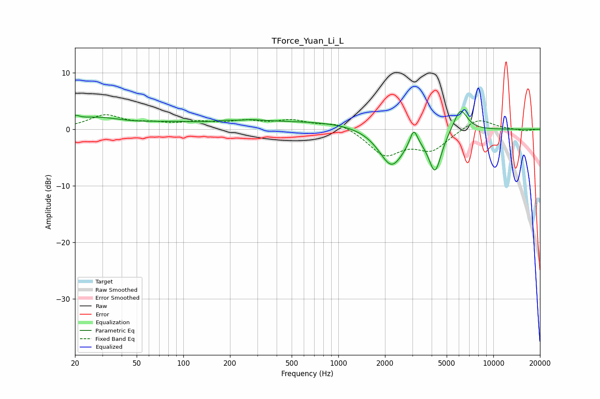

# TForce_Yuan_Li_L
See [usage instructions](https://github.com/jaakkopasanen/AutoEq#usage) for more options and info.

### Parametric EQs
Apply preamp of -3.2 dB when using parametric equalizer.

|   # | Type    |   Fc (Hz) |    Q |   Gain (dB) |
|-----|---------|-----------|------|-------------|
|   1 | Peaking |        20 | 5.81 |         0.8 |
|   2 | Peaking |        26 | 0.81 |         1.9 |
|   3 | Peaking |        83 | 0.73 |         0.8 |
|   4 | Peaking |       227 | 2.2  |        -0.9 |
|   5 | Peaking |       227 | 1.43 |         1.5 |
|   6 | Peaking |       702 | 0.31 |         1.4 |
|   7 | Peaking |      2203 | 1.71 |        -6.9 |
|   8 | Peaking |      3063 | 5.85 |         3   |
|   9 | Peaking |      4205 | 3.35 |        -7.2 |
|  10 | Peaking |      6127 | 3.05 |         4.2 |

### Fixed Band EQs
When using fixed band (also called graphic) equalizer, apply preamp of **-2.6 dB** (if available) and set gains manually with these parameters.

|   # | Type    |   Fc (Hz) |    Q |   Gain (dB) |
|-----|---------|-----------|------|-------------|
|   1 | Peaking |        31 | 1.41 |         2.4 |
|   2 | Peaking |        62 | 1.41 |         0.8 |
|   3 | Peaking |       125 | 1.41 |         1   |
|   4 | Peaking |       250 | 1.41 |         1.2 |
|   5 | Peaking |       500 | 1.41 |         1.4 |
|   6 | Peaking |      1000 | 1.41 |         1.3 |
|   7 | Peaking |      2000 | 1.41 |        -4.4 |
|   8 | Peaking |      4000 | 1.41 |        -3.4 |
|   9 | Peaking |      8000 | 1.41 |         2.1 |
|  10 | Peaking |     16000 | 1.41 |        -0.3 |

### Graphs

