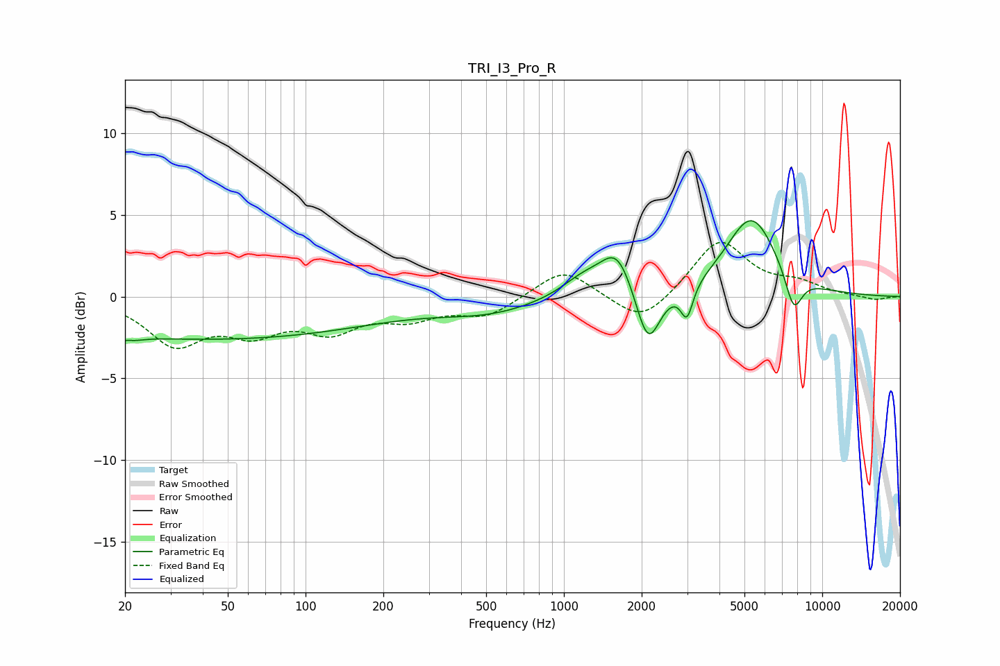

# TRI_I3_Pro_R
See [usage instructions](https://github.com/jaakkopasanen/AutoEq#usage) for more options and info.

### Parametric EQs
Apply preamp of -4.7 dB when using parametric equalizer.

|   # | Type    |   Fc (Hz) |    Q |   Gain (dB) |
|-----|---------|-----------|------|-------------|
|   1 | Peaking |        20 | 3.99 |        -2.5 |
|   2 | Peaking |        20 | 4.54 |         2.1 |
|   3 | Peaking |        43 | 0.21 |        -2.6 |
|   4 | Peaking |       518 | 0.72 |        -0.9 |
|   5 | Peaking |      1198 | 1.58 |         1.2 |
|   6 | Peaking |      1607 | 2.28 |         2.6 |
|   7 | Peaking |      2117 | 3.02 |        -3.7 |
|   8 | Peaking |      2995 | 6    |        -2   |
|   9 | Peaking |      5320 | 1.4  |         4.9 |
|  10 | Peaking |      7750 | 4.03 |        -2.3 |

### Fixed Band EQs
When using fixed band (also called graphic) equalizer, apply preamp of **-3.4 dB** (if available) and set gains manually with these parameters.

|   # | Type    |   Fc (Hz) |    Q |   Gain (dB) |
|-----|---------|-----------|------|-------------|
|   1 | Peaking |        31 | 1.41 |        -2.7 |
|   2 | Peaking |        62 | 1.41 |        -1.8 |
|   3 | Peaking |       125 | 1.41 |        -1.8 |
|   4 | Peaking |       250 | 1.41 |        -1.1 |
|   5 | Peaking |       500 | 1.41 |        -1.1 |
|   6 | Peaking |      1000 | 1.41 |         1.8 |
|   7 | Peaking |      2000 | 1.41 |        -1.8 |
|   8 | Peaking |      4000 | 1.41 |         3.5 |
|   9 | Peaking |      8000 | 1.41 |         0.7 |
|  10 | Peaking |     16000 | 1.41 |        -0.2 |

### Graphs

