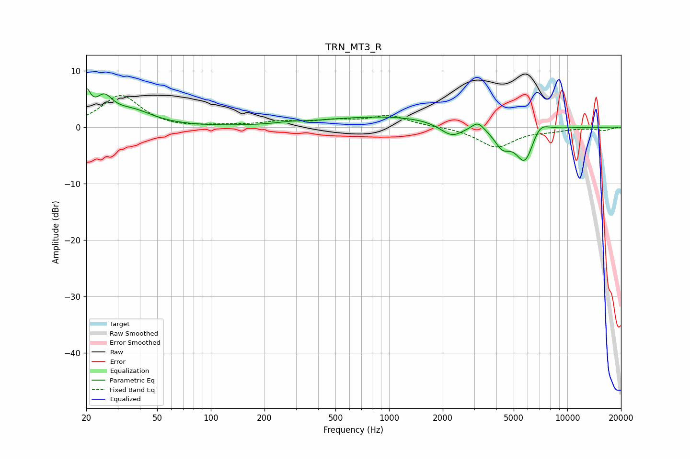

# TRN_MT3_R
See [usage instructions](https://github.com/jaakkopasanen/AutoEq#usage) for more options and info.

### Parametric EQs
Apply preamp of -6.9 dB when using parametric equalizer.

|   # | Type    |   Fc (Hz) |    Q |   Gain (dB) |
|-----|---------|-----------|------|-------------|
|   1 | Peaking |        20 | 6    |         4.6 |
|   2 | Peaking |        25 | 2.94 |         3.9 |
|   3 | Peaking |        36 | 1.2  |         2.6 |
|   4 | Peaking |       282 | 1.99 |         0.3 |
|   5 | Peaking |      1001 | 0.38 |         1.9 |
|   6 | Peaking |      2248 | 2.11 |        -2.5 |
|   7 | Peaking |      3149 | 4.21 |         1.4 |
|   8 | Peaking |      4319 | 3.05 |        -3   |
|   9 | Peaking |      5791 | 2.57 |        -6.5 |
|  10 | Peaking |      6961 | 2.63 |         2.4 |

### Fixed Band EQs
When using fixed band (also called graphic) equalizer, apply preamp of **-5.7 dB** (if available) and set gains manually with these parameters.

|   # | Type    |   Fc (Hz) |    Q |   Gain (dB) |
|-----|---------|-----------|------|-------------|
|   1 | Peaking |        31 | 1.41 |         5.6 |
|   2 | Peaking |        62 | 1.41 |        -0.2 |
|   3 | Peaking |       125 | 1.41 |         0.2 |
|   4 | Peaking |       250 | 1.41 |         0.8 |
|   5 | Peaking |       500 | 1.41 |         1   |
|   6 | Peaking |      1000 | 1.41 |         1.9 |
|   7 | Peaking |      2000 | 1.41 |         0.1 |
|   8 | Peaking |      4000 | 1.41 |        -3.5 |
|   9 | Peaking |      8000 | 1.41 |        -0.5 |
|  10 | Peaking |     16000 | 1.41 |        -0.6 |

### Graphs

