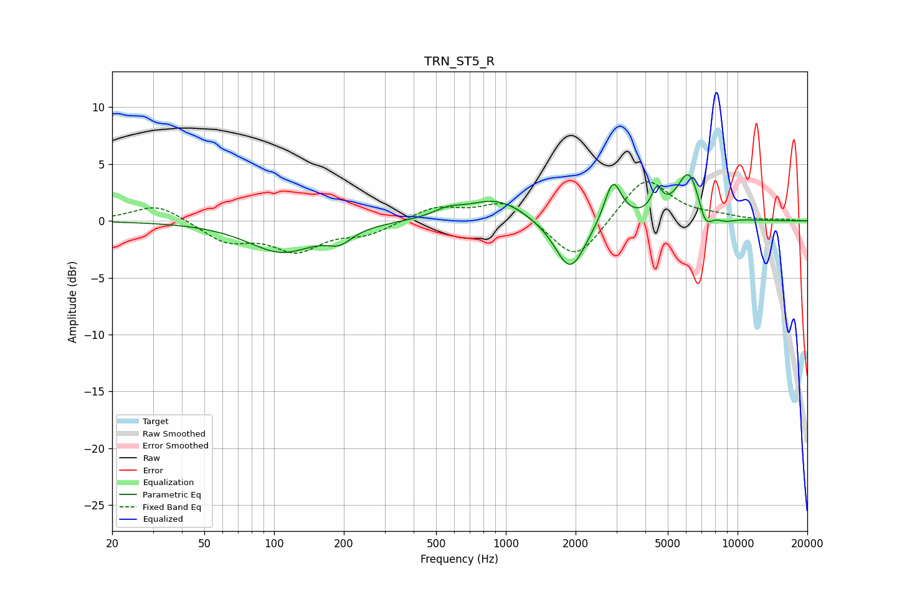

# TRN_ST5_R
See [usage instructions](https://github.com/jaakkopasanen/AutoEq#usage) for more options and info.

### Parametric EQs
Apply preamp of -4.2 dB when using parametric equalizer.

|   # | Type    |   Fc (Hz) |    Q |   Gain (dB) |
|-----|---------|-----------|------|-------------|
|   1 | Peaking |       108 | 0.97 |        -2.7 |
|   2 | Peaking |       192 | 2.64 |        -1.1 |
|   3 | Peaking |       562 | 2.16 |         0.7 |
|   4 | Peaking |       917 | 1.15 |         2   |
|   5 | Peaking |      1896 | 2.14 |        -4.7 |
|   6 | Peaking |      2899 | 3.8  |         3.8 |
|   7 | Peaking |      4483 | 6    |         2   |
|   8 | Peaking |      6178 | 2.63 |         4.5 |
|   9 | Peaking |      7245 | 4.31 |        -2   |
|  10 | Peaking |      8862 | 3.02 |        -0.4 |

### Fixed Band EQs
When using fixed band (also called graphic) equalizer, apply preamp of **-3.5 dB** (if available) and set gains manually with these parameters.

|   # | Type    |   Fc (Hz) |    Q |   Gain (dB) |
|-----|---------|-----------|------|-------------|
|   1 | Peaking |        31 | 1.41 |         1.5 |
|   2 | Peaking |        62 | 1.41 |        -1.7 |
|   3 | Peaking |       125 | 1.41 |        -2.4 |
|   4 | Peaking |       250 | 1.41 |        -1.1 |
|   5 | Peaking |       500 | 1.41 |         1.2 |
|   6 | Peaking |      1000 | 1.41 |         1.8 |
|   7 | Peaking |      2000 | 1.41 |        -3.8 |
|   8 | Peaking |      4000 | 1.41 |         4   |
|   9 | Peaking |      8000 | 1.41 |         0.3 |
|  10 | Peaking |     16000 | 1.41 |         0.1 |

### Graphs

