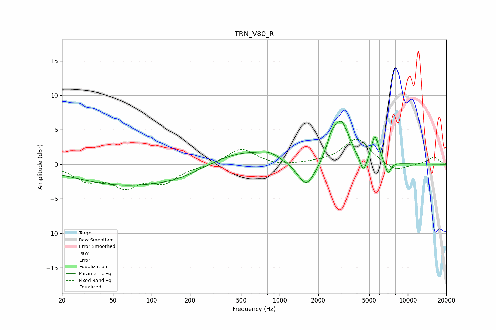

# TRN_V80_R
See [usage instructions](https://github.com/jaakkopasanen/AutoEq#usage) for more options and info.

### Parametric EQs
Apply preamp of -6.3 dB when using parametric equalizer.

|   # | Type    |   Fc (Hz) |    Q |   Gain (dB) |
|-----|---------|-----------|------|-------------|
|   1 | Peaking |        65 | 0.32 |        -3   |
|   2 | Peaking |       162 | 0.97 |        -0.5 |
|   3 | Peaking |       522 | 0.6  |         2   |
|   4 | Peaking |       835 | 2.02 |         0.7 |
|   5 | Peaking |      1623 | 2    |        -3.9 |
|   6 | Peaking |      2525 | 4.11 |         1.8 |
|   7 | Peaking |      3017 | 2.24 |         6   |
|   8 | Peaking |      4508 | 4.95 |        -2.6 |
|   9 | Peaking |      5545 | 4.74 |         4   |
|  10 | Peaking |      7010 | 5.95 |        -1.9 |

### Fixed Band EQs
When using fixed band (also called graphic) equalizer, apply preamp of **-3.7 dB** (if available) and set gains manually with these parameters.

|   # | Type    |   Fc (Hz) |    Q |   Gain (dB) |
|-----|---------|-----------|------|-------------|
|   1 | Peaking |        31 | 1.41 |        -2.1 |
|   2 | Peaking |        62 | 1.41 |        -2.9 |
|   3 | Peaking |       125 | 1.41 |        -2.3 |
|   4 | Peaking |       250 | 1.41 |        -0.3 |
|   5 | Peaking |       500 | 1.41 |         2.3 |
|   6 | Peaking |      1000 | 1.41 |        -0.3 |
|   7 | Peaking |      2000 | 1.41 |         0.1 |
|   8 | Peaking |      4000 | 1.41 |         3.8 |
|   9 | Peaking |      8000 | 1.41 |        -1.2 |
|  10 | Peaking |     16000 | 1.41 |         1.1 |

### Graphs

