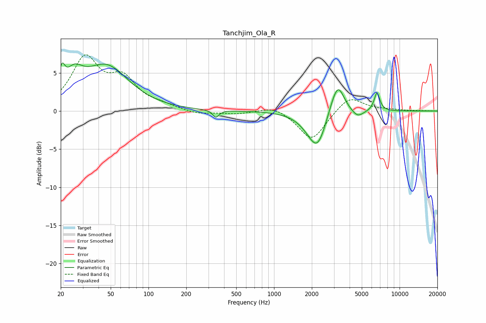

# Tanchjim_Ola_R
See [usage instructions](https://github.com/jaakkopasanen/AutoEq#usage) for more options and info.

### Parametric EQs
Apply preamp of -6.4 dB when using parametric equalizer.

|   # | Type    |   Fc (Hz) |    Q |   Gain (dB) |
|-----|---------|-----------|------|-------------|
|   1 | Peaking |        20 | 6    |         2.8 |
|   2 | Peaking |        25 | 2.06 |         2.9 |
|   3 | Peaking |        46 | 0.79 |         5.7 |
|   4 | Peaking |       344 | 5.78 |        -0.9 |
|   5 | Peaking |      1891 | 1.6  |        -0.9 |
|   6 | Peaking |      2222 | 2.06 |        -4.3 |
|   7 | Peaking |      2858 | 2.82 |         0.7 |
|   8 | Peaking |      3231 | 2.78 |         3.8 |
|   9 | Peaking |      4630 | 3.07 |        -0.9 |
|  10 | Peaking |      6603 | 6    |         2.4 |

### Fixed Band EQs
When using fixed band (also called graphic) equalizer, apply preamp of **-7.5 dB** (if available) and set gains manually with these parameters.

|   # | Type    |   Fc (Hz) |    Q |   Gain (dB) |
|-----|---------|-----------|------|-------------|
|   1 | Peaking |        31 | 1.41 |         6.7 |
|   2 | Peaking |        62 | 1.41 |         3.7 |
|   3 | Peaking |       125 | 1.41 |         0.6 |
|   4 | Peaking |       250 | 1.41 |        -0.5 |
|   5 | Peaking |       500 | 1.41 |        -0.4 |
|   6 | Peaking |      1000 | 1.41 |         0.8 |
|   7 | Peaking |      2000 | 1.41 |        -3.9 |
|   8 | Peaking |      4000 | 1.41 |         2.1 |
|   9 | Peaking |      8000 | 1.41 |         0.2 |
|  10 | Peaking |     16000 | 1.41 |         0   |

### Graphs

