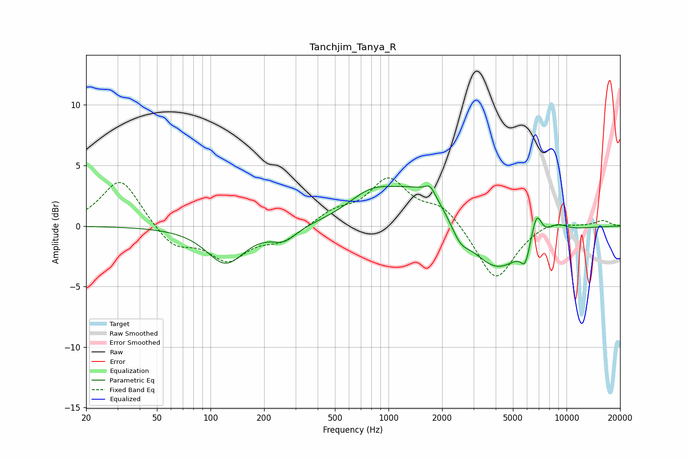

# Tanchjim_Tanya_R
See [usage instructions](https://github.com/jaakkopasanen/AutoEq#usage) for more options and info.

### Parametric EQs
Apply preamp of -3.4 dB when using parametric equalizer.

|   # | Type    |   Fc (Hz) |    Q |   Gain (dB) |
|-----|---------|-----------|------|-------------|
|   1 | Peaking |       121 | 1.33 |        -3.1 |
|   2 | Peaking |       259 | 2.01 |        -1.1 |
|   3 | Peaking |       789 | 1.1  |         1.8 |
|   4 | Peaking |      1621 | 0.69 |         3.5 |
|   5 | Peaking |      1713 | 5.06 |         0.8 |
|   6 | Peaking |      2518 | 2.64 |        -1.5 |
|   7 | Peaking |      3957 | 0.87 |        -4.3 |
|   8 | Peaking |      5858 | 5.69 |        -1.5 |
|   9 | Peaking |      6787 | 4.72 |         2.3 |
|  10 | Peaking |      8859 | 2.26 |         0.7 |

### Fixed Band EQs
When using fixed band (also called graphic) equalizer, apply preamp of **-4.1 dB** (if available) and set gains manually with these parameters.

|   # | Type    |   Fc (Hz) |    Q |   Gain (dB) |
|-----|---------|-----------|------|-------------|
|   1 | Peaking |        31 | 1.41 |         4   |
|   2 | Peaking |        62 | 1.41 |        -1.8 |
|   3 | Peaking |       125 | 1.41 |        -2.6 |
|   4 | Peaking |       250 | 1.41 |        -1.2 |
|   5 | Peaking |       500 | 1.41 |         1.1 |
|   6 | Peaking |      1000 | 1.41 |         3.7 |
|   7 | Peaking |      2000 | 1.41 |         1.6 |
|   8 | Peaking |      4000 | 1.41 |        -4.6 |
|   9 | Peaking |      8000 | 1.41 |         0.5 |
|  10 | Peaking |     16000 | 1.41 |         0.5 |

### Graphs

