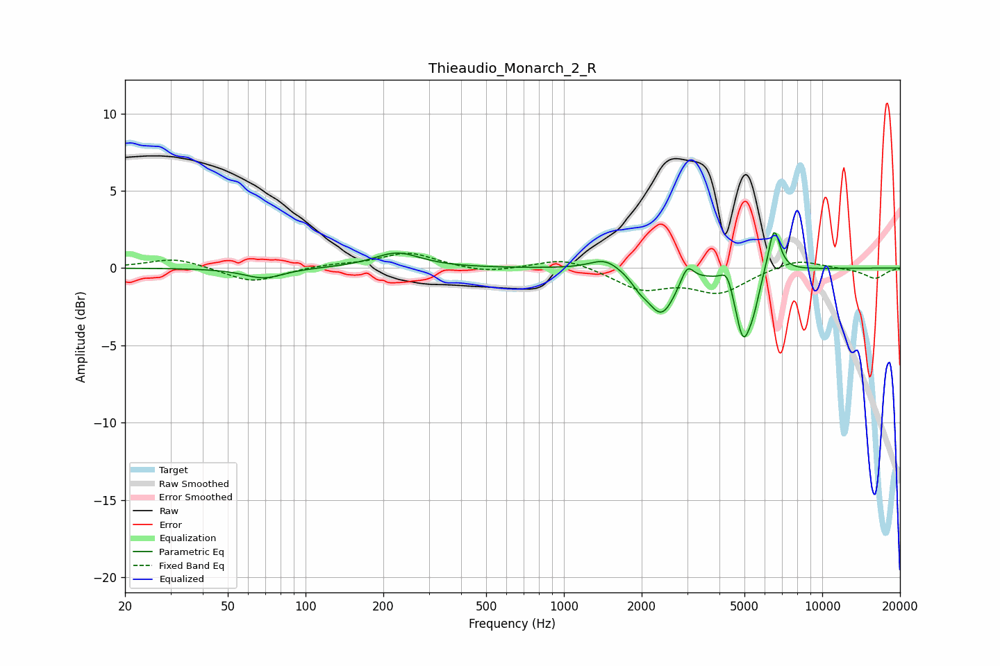

# Thieaudio_Monarch_2_R
See [usage instructions](https://github.com/jaakkopasanen/AutoEq#usage) for more options and info.

### Parametric EQs
Apply preamp of -2.4 dB when using parametric equalizer.

|   # | Type    |   Fc (Hz) |    Q |   Gain (dB) |
|-----|---------|-----------|------|-------------|
|   1 | Peaking |        69 | 1.86 |        -0.7 |
|   2 | Peaking |       226 | 1.57 |         1   |
|   3 | Peaking |      1448 | 2.37 |         0.8 |
|   4 | Peaking |      1963 | 4.32 |        -0.5 |
|   5 | Peaking |      2387 | 2.62 |        -2.9 |
|   6 | Peaking |      3001 | 5.89 |         1.2 |
|   7 | Peaking |      4286 | 6    |         1.1 |
|   8 | Peaking |      4941 | 4.39 |        -4.3 |
|   9 | Peaking |      5432 | 6    |        -1.2 |
|  10 | Peaking |      6509 | 5.93 |         3   |

### Fixed Band EQs
When using fixed band (also called graphic) equalizer, apply preamp of **-1.1 dB** (if available) and set gains manually with these parameters.

|   # | Type    |   Fc (Hz) |    Q |   Gain (dB) |
|-----|---------|-----------|------|-------------|
|   1 | Peaking |        31 | 1.41 |         0.7 |
|   2 | Peaking |        62 | 1.41 |        -1   |
|   3 | Peaking |       125 | 1.41 |         0.2 |
|   4 | Peaking |       250 | 1.41 |         1   |
|   5 | Peaking |       500 | 1.41 |        -0.3 |
|   6 | Peaking |      1000 | 1.41 |         0.7 |
|   7 | Peaking |      2000 | 1.41 |        -1.3 |
|   8 | Peaking |      4000 | 1.41 |        -1.5 |
|   9 | Peaking |      8000 | 1.41 |         0.6 |
|  10 | Peaking |     16000 | 1.41 |        -0.7 |

### Graphs

