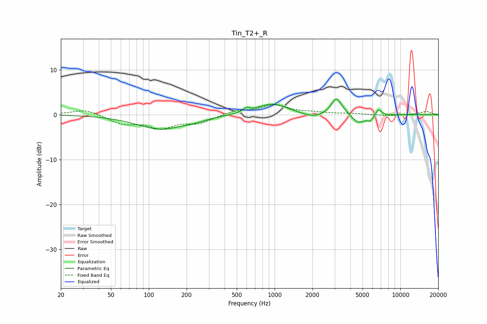

# Tin_T2+_R
See [usage instructions](https://github.com/jaakkopasanen/AutoEq#usage) for more options and info.

### Parametric EQs
Apply preamp of -3.6 dB when using parametric equalizer.

|   # | Type    |   Fc (Hz) |    Q |   Gain (dB) |
|-----|---------|-----------|------|-------------|
|   1 | Peaking |       124 | 0.74 |        -3.2 |
|   2 | Peaking |       236 | 1.62 |        -0.5 |
|   3 | Peaking |       594 | 5.15 |         0.9 |
|   4 | Peaking |       962 | 1.17 |         2.5 |
|   5 | Peaking |      2029 | 1.65 |        -1   |
|   6 | Peaking |      3081 | 3.74 |         3.1 |
|   7 | Peaking |      3354 | 2.12 |         1   |
|   8 | Peaking |      4624 | 2.44 |        -2.1 |
|   9 | Peaking |      5777 | 6    |        -1   |
|  10 | Peaking |      6695 | 6    |         1.5 |

### Fixed Band EQs
When using fixed band (also called graphic) equalizer, apply preamp of **-2.3 dB** (if available) and set gains manually with these parameters.

|   # | Type    |   Fc (Hz) |    Q |   Gain (dB) |
|-----|---------|-----------|------|-------------|
|   1 | Peaking |        31 | 1.41 |         1.3 |
|   2 | Peaking |        62 | 1.41 |        -1.9 |
|   3 | Peaking |       125 | 1.41 |        -2.6 |
|   4 | Peaking |       250 | 1.41 |        -1.7 |
|   5 | Peaking |       500 | 1.41 |         0.9 |
|   6 | Peaking |      1000 | 1.41 |         2   |
|   7 | Peaking |      2000 | 1.41 |         0.4 |
|   8 | Peaking |      4000 | 1.41 |         0.2 |
|   9 | Peaking |      8000 | 1.41 |        -0.3 |
|  10 | Peaking |     16000 | 1.41 |         0.7 |

### Graphs

