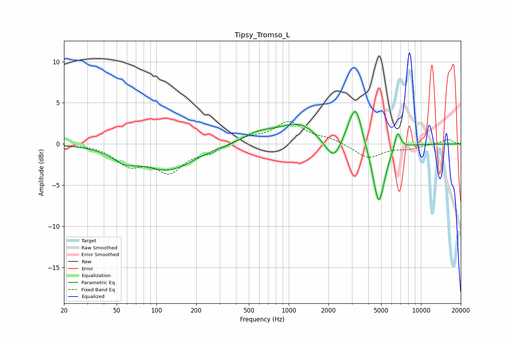

# Tipsy_Tromso_L
See [usage instructions](https://github.com/jaakkopasanen/AutoEq#usage) for more options and info.

### Parametric EQs
Apply preamp of -4.0 dB when using parametric equalizer.

|   # | Type    |   Fc (Hz) |    Q |   Gain (dB) |
|-----|---------|-----------|------|-------------|
|   1 | Peaking |        57 | 1.52 |        -1.3 |
|   2 | Peaking |       123 | 0.72 |        -3   |
|   3 | Peaking |       575 | 1.22 |         0.9 |
|   4 | Peaking |      1241 | 0.8  |         2.6 |
|   5 | Peaking |      1759 | 1.88 |        -0.5 |
|   6 | Peaking |      2187 | 2.38 |        -2.7 |
|   7 | Peaking |      2900 | 2.98 |         1.3 |
|   8 | Peaking |      3243 | 3.3  |         4   |
|   9 | Peaking |      4796 | 3.08 |        -7.5 |
|  10 | Peaking |      6657 | 5.92 |         2.3 |

### Fixed Band EQs
When using fixed band (also called graphic) equalizer, apply preamp of **-2.8 dB** (if available) and set gains manually with these parameters.

|   # | Type    |   Fc (Hz) |    Q |   Gain (dB) |
|-----|---------|-----------|------|-------------|
|   1 | Peaking |        31 | 1.41 |         0   |
|   2 | Peaking |        62 | 1.41 |        -2.3 |
|   3 | Peaking |       125 | 1.41 |        -3.1 |
|   4 | Peaking |       250 | 1.41 |        -0.8 |
|   5 | Peaking |       500 | 1.41 |         0.8 |
|   6 | Peaking |      1000 | 1.41 |         2.6 |
|   7 | Peaking |      2000 | 1.41 |         0.6 |
|   8 | Peaking |      4000 | 1.41 |        -1.7 |
|   9 | Peaking |      8000 | 1.41 |        -0.5 |
|  10 | Peaking |     16000 | 1.41 |         0.6 |

### Graphs

