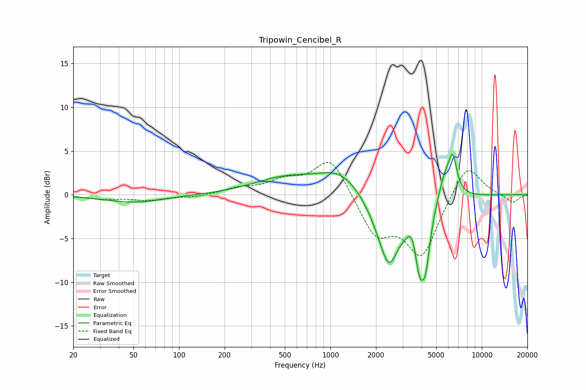

# Tripowin_Cencibel_R
See [usage instructions](https://github.com/jaakkopasanen/AutoEq#usage) for more options and info.

### Parametric EQs
Apply preamp of -4.7 dB when using parametric equalizer.

|   # | Type    |   Fc (Hz) |    Q |   Gain (dB) |
|-----|---------|-----------|------|-------------|
|   1 | Peaking |        51 | 0.72 |        -0.9 |
|   2 | Peaking |       494 | 0.68 |         1.7 |
|   3 | Peaking |      1175 | 0.95 |         2.6 |
|   4 | Peaking |      2381 | 1.55 |        -6.1 |
|   5 | Peaking |      2439 | 3.42 |        -1.8 |
|   6 | Peaking |      3515 | 4    |         3.7 |
|   7 | Peaking |      3868 | 2.8  |        -9.5 |
|   8 | Peaking |      4270 | 6    |        -2.9 |
|   9 | Peaking |      5659 | 2.85 |         3.1 |
|  10 | Peaking |      6421 | 4.9  |         3.9 |

### Fixed Band EQs
When using fixed band (also called graphic) equalizer, apply preamp of **-3.8 dB** (if available) and set gains manually with these parameters.

|   # | Type    |   Fc (Hz) |    Q |   Gain (dB) |
|-----|---------|-----------|------|-------------|
|   1 | Peaking |        31 | 1.41 |        -0.5 |
|   2 | Peaking |        62 | 1.41 |        -0.6 |
|   3 | Peaking |       125 | 1.41 |        -0.3 |
|   4 | Peaking |       250 | 1.41 |         0.7 |
|   5 | Peaking |       500 | 1.41 |         1.4 |
|   6 | Peaking |      1000 | 1.41 |         4.4 |
|   7 | Peaking |      2000 | 1.41 |        -4.5 |
|   8 | Peaking |      4000 | 1.41 |        -6.8 |
|   9 | Peaking |      8000 | 1.41 |         3.9 |
|  10 | Peaking |     16000 | 1.41 |        -1   |

### Graphs

