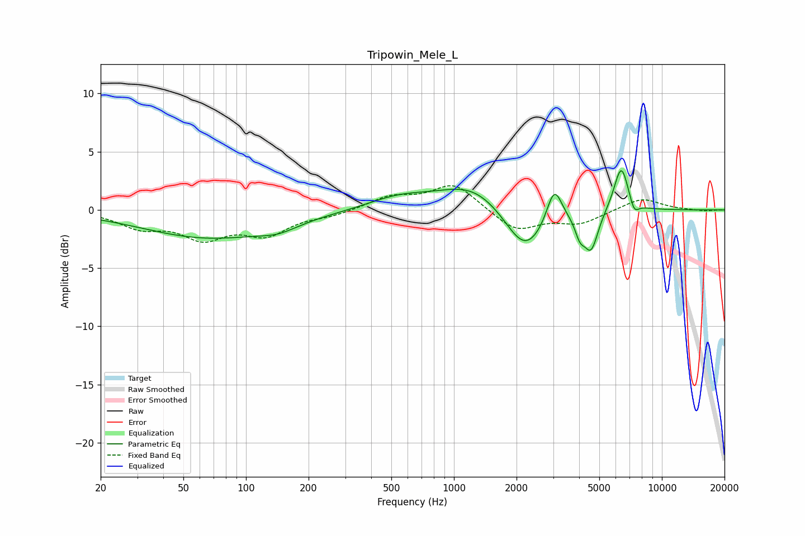

# Tripowin_Mele_L
See [usage instructions](https://github.com/jaakkopasanen/AutoEq#usage) for more options and info.

### Parametric EQs
Apply preamp of -3.5 dB when using parametric equalizer.

|   # | Type    |   Fc (Hz) |    Q |   Gain (dB) |
|-----|---------|-----------|------|-------------|
|   1 | Peaking |        66 | 0.44 |        -2.4 |
|   2 | Peaking |       143 | 1.52 |        -0.6 |
|   3 | Peaking |       543 | 0.93 |         1   |
|   4 | Peaking |      1239 | 0.87 |         2.3 |
|   5 | Peaking |      2200 | 1.43 |        -4.1 |
|   6 | Peaking |      3037 | 3.82 |         3.2 |
|   7 | Peaking |      4033 | 6    |        -1.4 |
|   8 | Peaking |      4566 | 4.08 |        -3.3 |
|   9 | Peaking |      6378 | 3.84 |         4   |
|  10 | Peaking |      7352 | 5.93 |        -1.1 |

### Fixed Band EQs
When using fixed band (also called graphic) equalizer, apply preamp of **-2.2 dB** (if available) and set gains manually with these parameters.

|   # | Type    |   Fc (Hz) |    Q |   Gain (dB) |
|-----|---------|-----------|------|-------------|
|   1 | Peaking |        31 | 1.41 |        -1.3 |
|   2 | Peaking |        62 | 1.41 |        -2.2 |
|   3 | Peaking |       125 | 1.41 |        -1.9 |
|   4 | Peaking |       250 | 1.41 |        -0.4 |
|   5 | Peaking |       500 | 1.41 |         1.1 |
|   6 | Peaking |      1000 | 1.41 |         2.2 |
|   7 | Peaking |      2000 | 1.41 |        -1.8 |
|   8 | Peaking |      4000 | 1.41 |        -1.1 |
|   9 | Peaking |      8000 | 1.41 |         1.1 |
|  10 | Peaking |     16000 | 1.41 |        -0.1 |

### Graphs

