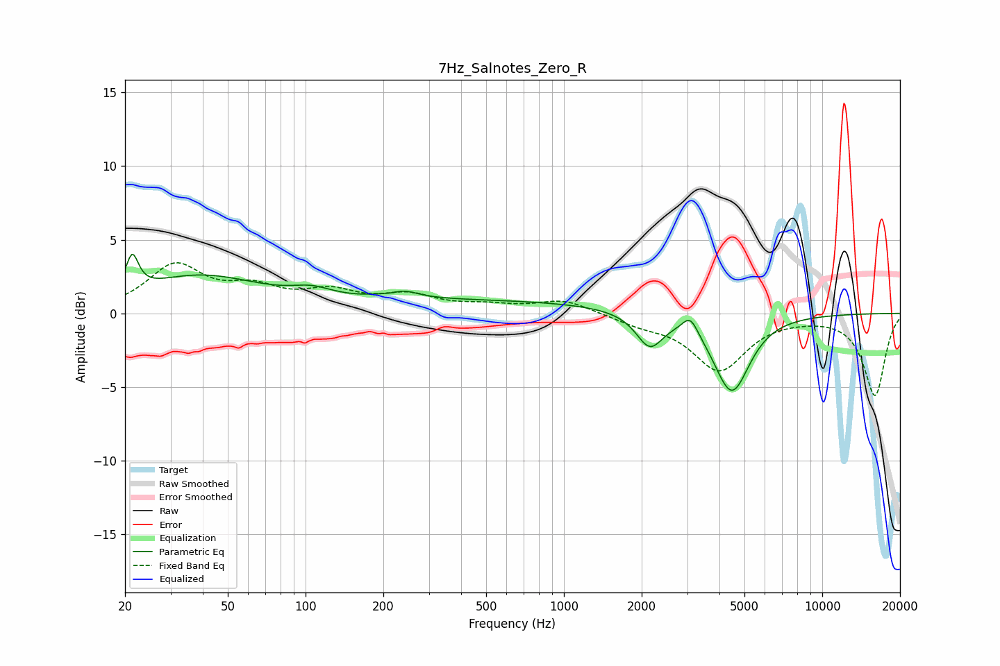

# 7Hz_Salnotes_Zero_R
See [usage instructions](https://github.com/jaakkopasanen/AutoEq#usage) for more options and info.

### Parametric EQs
Apply preamp of -4.1 dB when using parametric equalizer.

|   # | Type    |   Fc (Hz) |    Q |   Gain (dB) |
|-----|---------|-----------|------|-------------|
|   1 | Peaking |        21 | 5.98 |         2.4 |
|   2 | Peaking |        39 | 0.59 |         2.4 |
|   3 | Peaking |       106 | 1.8  |         0.6 |
|   4 | Peaking |       220 | 2.91 |        -1   |
|   5 | Peaking |       226 | 2.43 |         1.4 |
|   6 | Peaking |       479 | 0.25 |         0.8 |
|   7 | Peaking |      2141 | 2.28 |        -0.5 |
|   8 | Peaking |      2151 | 2.83 |        -1.8 |
|   9 | Peaking |      3085 | 4.69 |         1.2 |
|  10 | Peaking |      4464 | 2.03 |        -5.3 |

### Fixed Band EQs
When using fixed band (also called graphic) equalizer, apply preamp of **-3.5 dB** (if available) and set gains manually with these parameters.

|   # | Type    |   Fc (Hz) |    Q |   Gain (dB) |
|-----|---------|-----------|------|-------------|
|   1 | Peaking |        31 | 1.41 |         3.1 |
|   2 | Peaking |        62 | 1.41 |         1.4 |
|   3 | Peaking |       125 | 1.41 |         1.2 |
|   4 | Peaking |       250 | 1.41 |         1.1 |
|   5 | Peaking |       500 | 1.41 |         0.4 |
|   6 | Peaking |      1000 | 1.41 |         0.9 |
|   7 | Peaking |      2000 | 1.41 |        -0.6 |
|   8 | Peaking |      4000 | 1.41 |        -3.8 |
|   9 | Peaking |      8000 | 1.41 |        -0.1 |
|  10 | Peaking |     16000 | 1.41 |        -5.6 |

### Graphs

