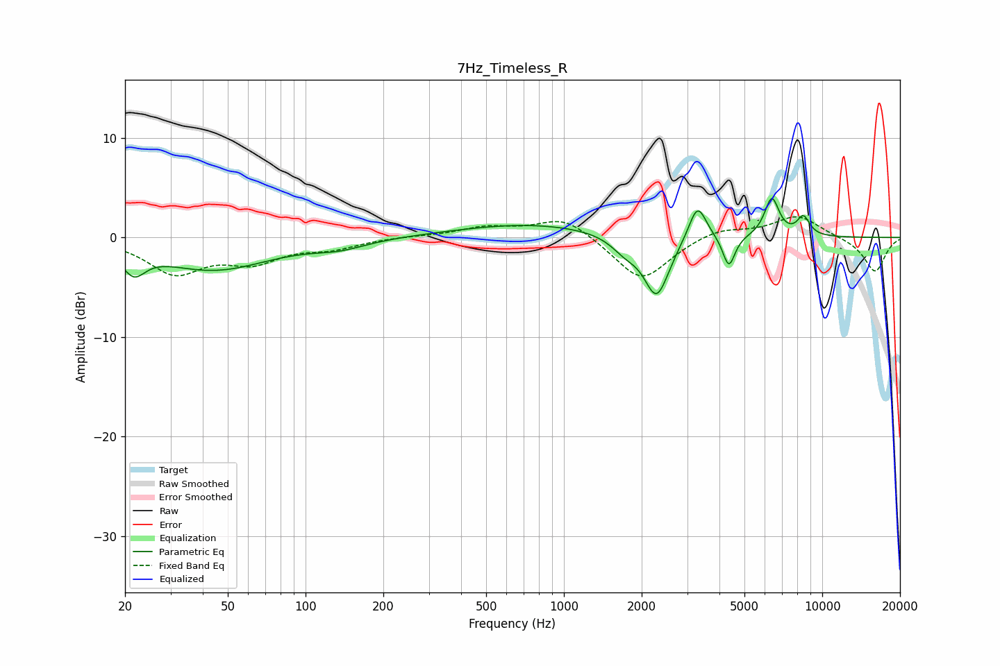

# 7Hz_Timeless_R
See [usage instructions](https://github.com/jaakkopasanen/AutoEq#usage) for more options and info.

### Parametric EQs
Apply preamp of -4.0 dB when using parametric equalizer.

|   # | Type    |   Fc (Hz) |    Q |   Gain (dB) |
|-----|---------|-----------|------|-------------|
|   1 | Peaking |        22 | 3.26 |        -2.4 |
|   2 | Peaking |        44 | 0.65 |        -3.2 |
|   3 | Peaking |       136 | 1.38 |        -0.8 |
|   4 | Peaking |       744 | 0.49 |         1.4 |
|   5 | Peaking |      1723 | 2.63 |        -1.3 |
|   6 | Peaking |      2286 | 2.87 |        -6.1 |
|   7 | Peaking |      3290 | 4.09 |         3.7 |
|   8 | Peaking |      4350 | 5.97 |        -3.2 |
|   9 | Peaking |      6381 | 4.86 |         3.9 |
|  10 | Peaking |      8456 | 5.19 |         1.9 |

### Fixed Band EQs
When using fixed band (also called graphic) equalizer, apply preamp of **-2.2 dB** (if available) and set gains manually with these parameters.

|   # | Type    |   Fc (Hz) |    Q |   Gain (dB) |
|-----|---------|-----------|------|-------------|
|   1 | Peaking |        31 | 1.41 |        -3.4 |
|   2 | Peaking |        62 | 1.41 |        -2.1 |
|   3 | Peaking |       125 | 1.41 |        -0.9 |
|   4 | Peaking |       250 | 1.41 |         0.1 |
|   5 | Peaking |       500 | 1.41 |         1   |
|   6 | Peaking |      1000 | 1.41 |         2.1 |
|   7 | Peaking |      2000 | 1.41 |        -4.5 |
|   8 | Peaking |      4000 | 1.41 |         1   |
|   9 | Peaking |      8000 | 1.41 |         2.2 |
|  10 | Peaking |     16000 | 1.41 |        -3.5 |

### Graphs

