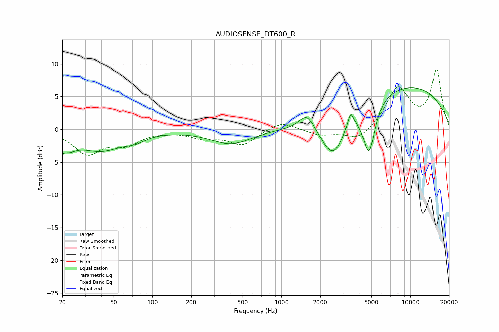

# AUDIOSENSE_DT600_R
See [usage instructions](https://github.com/jaakkopasanen/AutoEq#usage) for more options and info.

### Parametric EQs
Apply preamp of -6.4 dB when using parametric equalizer.

|   # | Type    |   Fc (Hz) |    Q |   Gain (dB) |
|-----|---------|-----------|------|-------------|
|   1 | Peaking |        20 | 2.32 |        -3.5 |
|   2 | Peaking |        21 | 4.41 |         1.2 |
|   3 | Peaking |        40 | 0.86 |        -3   |
|   4 | Peaking |        73 | 1.7  |        -0.9 |
|   5 | Peaking |       408 | 0.87 |        -2.2 |
|   6 | Peaking |      1578 | 2.51 |         2.4 |
|   7 | Peaking |      2516 | 1.49 |        -6.5 |
|   8 | Peaking |      3447 | 5.82 |         2.5 |
|   9 | Peaking |      4785 | 3.01 |        -7.8 |
|  10 | Peaking |      8887 | 0.27 |         6.8 |

### Fixed Band EQs
When using fixed band (also called graphic) equalizer, apply preamp of **-9.3 dB** (if available) and set gains manually with these parameters.

|   # | Type    |   Fc (Hz) |    Q |   Gain (dB) |
|-----|---------|-----------|------|-------------|
|   1 | Peaking |        31 | 1.41 |        -3.6 |
|   2 | Peaking |        62 | 1.41 |        -2   |
|   3 | Peaking |       125 | 1.41 |        -0.1 |
|   4 | Peaking |       250 | 1.41 |        -1.1 |
|   5 | Peaking |       500 | 1.41 |        -2.3 |
|   6 | Peaking |      1000 | 1.41 |         1.3 |
|   7 | Peaking |      2000 | 1.41 |        -0.9 |
|   8 | Peaking |      4000 | 1.41 |        -1.8 |
|   9 | Peaking |      8000 | 1.41 |         6.2 |
|  10 | Peaking |     16000 | 1.41 |         8.9 |

### Graphs

