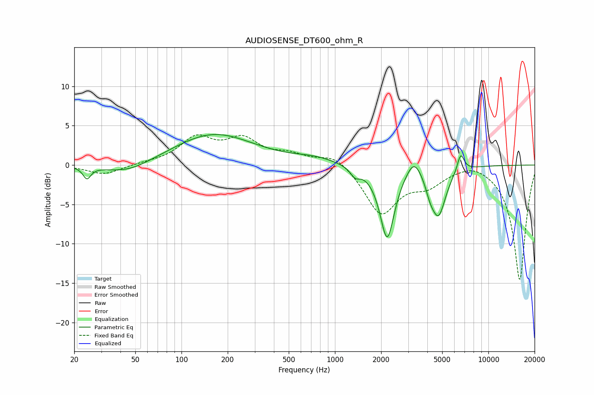

# AUDIOSENSE_DT600_ohm_R
See [usage instructions](https://github.com/jaakkopasanen/AutoEq#usage) for more options and info.

### Parametric EQs
Apply preamp of -4.0 dB when using parametric equalizer.

|   # | Type    |   Fc (Hz) |    Q |   Gain (dB) |
|-----|---------|-----------|------|-------------|
|   1 | Peaking |        24 | 5.7  |        -1.5 |
|   2 | Peaking |        45 | 0.91 |        -1.4 |
|   3 | Peaking |       162 | 0.54 |         4   |
|   4 | Peaking |       739 | 1    |         0.7 |
|   5 | Peaking |      1355 | 4.62 |        -1.1 |
|   6 | Peaking |      2190 | 2.92 |        -9.3 |
|   7 | Peaking |      3274 | 2.86 |         2.4 |
|   8 | Peaking |      4163 | 4.81 |        -1.4 |
|   9 | Peaking |      4727 | 2.89 |        -6   |
|  10 | Peaking |      6602 | 6    |         2.3 |

### Fixed Band EQs
When using fixed band (also called graphic) equalizer, apply preamp of **-3.9 dB** (if available) and set gains manually with these parameters.

|   # | Type    |   Fc (Hz) |    Q |   Gain (dB) |
|-----|---------|-----------|------|-------------|
|   1 | Peaking |        31 | 1.41 |        -1.2 |
|   2 | Peaking |        62 | 1.41 |         0.2 |
|   3 | Peaking |       125 | 1.41 |         3.2 |
|   4 | Peaking |       250 | 1.41 |         3   |
|   5 | Peaking |       500 | 1.41 |         1.1 |
|   6 | Peaking |      1000 | 1.41 |         1.5 |
|   7 | Peaking |      2000 | 1.41 |        -6.1 |
|   8 | Peaking |      4000 | 1.41 |        -2.1 |
|   9 | Peaking |      8000 | 1.41 |         0.7 |
|  10 | Peaking |     16000 | 1.41 |       -14.6 |

### Graphs

