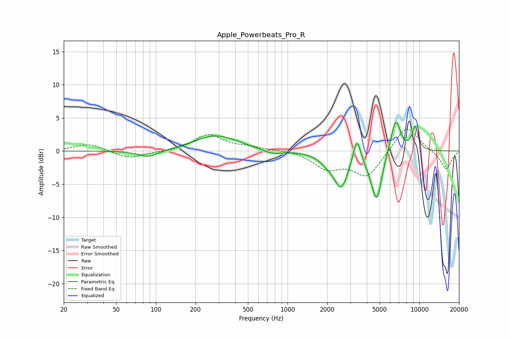

# Apple_Powerbeats_Pro_R
See [usage instructions](https://github.com/jaakkopasanen/AutoEq#usage) for more options and info.

### Parametric EQs
Apply preamp of -4.4 dB when using parametric equalizer.

|   # | Type    |   Fc (Hz) |    Q |   Gain (dB) |
|-----|---------|-----------|------|-------------|
|   1 | Peaking |        88 | 1.84 |        -1.1 |
|   2 | Peaking |       287 | 0.87 |         2.3 |
|   3 | Peaking |       768 | 2.04 |        -0.7 |
|   4 | Peaking |      1965 | 2.49 |        -0.9 |
|   5 | Peaking |      2547 | 2.58 |        -5.2 |
|   6 | Peaking |      3356 | 4.99 |         3.9 |
|   7 | Peaking |      4358 | 2.94 |        -1.4 |
|   8 | Peaking |      4774 | 3.64 |        -6.4 |
|   9 | Peaking |      6616 | 3.64 |         5.2 |
|  10 | Peaking |      9280 | 5.37 |         3.5 |

### Fixed Band EQs
When using fixed band (also called graphic) equalizer, apply preamp of **-3.4 dB** (if available) and set gains manually with these parameters.

|   # | Type    |   Fc (Hz) |    Q |   Gain (dB) |
|-----|---------|-----------|------|-------------|
|   1 | Peaking |        31 | 1.41 |         1.1 |
|   2 | Peaking |        62 | 1.41 |        -1.2 |
|   3 | Peaking |       125 | 1.41 |        -0.1 |
|   4 | Peaking |       250 | 1.41 |         2.4 |
|   5 | Peaking |       500 | 1.41 |         0.5 |
|   6 | Peaking |      1000 | 1.41 |         0.2 |
|   7 | Peaking |      2000 | 1.41 |        -2.4 |
|   8 | Peaking |      4000 | 1.41 |        -3.8 |
|   9 | Peaking |      8000 | 1.41 |         4   |
|  10 | Peaking |     16000 | 1.41 |        -2.8 |

### Graphs

