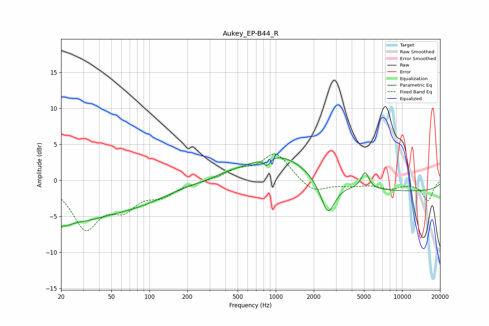

# Aukey_EP-B44_R
See [usage instructions](https://github.com/jaakkopasanen/AutoEq#usage) for more options and info.

### Parametric EQs
Apply preamp of -3.2 dB when using parametric equalizer.

|   # | Type    |   Fc (Hz) |    Q |   Gain (dB) |
|-----|---------|-----------|------|-------------|
|   1 | Peaking |        20 | 4.53 |        -4.4 |
|   2 | Peaking |        20 | 5.76 |         3.3 |
|   3 | Peaking |        23 | 0.45 |        -5.1 |
|   4 | Peaking |        84 | 0.56 |        -2.1 |
|   5 | Peaking |       419 | 1.6  |         0.3 |
|   6 | Peaking |       852 | 6    |        -1.1 |
|   7 | Peaking |      1057 | 0.61 |         3.8 |
|   8 | Peaking |      2583 | 2.52 |        -4.8 |
|   9 | Peaking |      5095 | 4.59 |         2.3 |
|  10 | Peaking |     10000 | 0.18 |        -1.5 |

### Fixed Band EQs
When using fixed band (also called graphic) equalizer, apply preamp of **-3.8 dB** (if available) and set gains manually with these parameters.

|   # | Type    |   Fc (Hz) |    Q |   Gain (dB) |
|-----|---------|-----------|------|-------------|
|   1 | Peaking |        31 | 1.41 |        -6.3 |
|   2 | Peaking |        62 | 1.41 |        -3.2 |
|   3 | Peaking |       125 | 1.41 |        -1.8 |
|   4 | Peaking |       250 | 1.41 |        -0.2 |
|   5 | Peaking |       500 | 1.41 |         1.3 |
|   6 | Peaking |      1000 | 1.41 |         3.8 |
|   7 | Peaking |      2000 | 1.41 |        -1.8 |
|   8 | Peaking |      4000 | 1.41 |        -0.6 |
|   9 | Peaking |      8000 | 1.41 |        -1   |
|  10 | Peaking |     16000 | 1.41 |        -2.8 |

### Graphs

