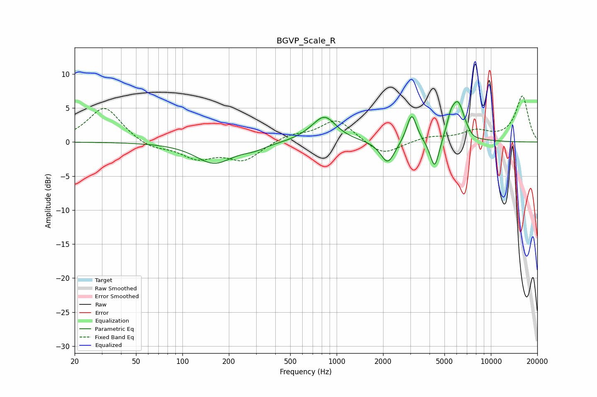

# BGVP_Scale_R
See [usage instructions](https://github.com/jaakkopasanen/AutoEq#usage) for more options and info.

### Parametric EQs
Apply preamp of -6.0 dB when using parametric equalizer.

|   # | Type    |   Fc (Hz) |    Q |   Gain (dB) |
|-----|---------|-----------|------|-------------|
|   1 | Peaking |       160 | 1.19 |        -3.1 |
|   2 | Peaking |       293 | 1.84 |        -0.7 |
|   3 | Peaking |       660 | 1.67 |         0.3 |
|   4 | Peaking |       835 | 1.87 |         3.6 |
|   5 | Peaking |      2144 | 3.08 |        -3.4 |
|   6 | Peaking |      3067 | 4.5  |         4.3 |
|   7 | Peaking |      4324 | 4.66 |        -4.6 |
|   8 | Peaking |      5491 | 5.98 |         1.5 |
|   9 | Peaking |      6106 | 2.92 |         5.9 |
|  10 | Peaking |      7588 | 3.08 |        -0.6 |

### Fixed Band EQs
When using fixed band (also called graphic) equalizer, apply preamp of **-6.9 dB** (if available) and set gains manually with these parameters.

|   # | Type    |   Fc (Hz) |    Q |   Gain (dB) |
|-----|---------|-----------|------|-------------|
|   1 | Peaking |        31 | 1.41 |         5.2 |
|   2 | Peaking |        62 | 1.41 |        -1.1 |
|   3 | Peaking |       125 | 1.41 |        -2.2 |
|   4 | Peaking |       250 | 1.41 |        -2.6 |
|   5 | Peaking |       500 | 1.41 |         1   |
|   6 | Peaking |      1000 | 1.41 |         3.3 |
|   7 | Peaking |      2000 | 1.41 |        -2.1 |
|   8 | Peaking |      4000 | 1.41 |         0.7 |
|   9 | Peaking |      8000 | 1.41 |         1.5 |
|  10 | Peaking |     16000 | 1.41 |         6.7 |

### Graphs

