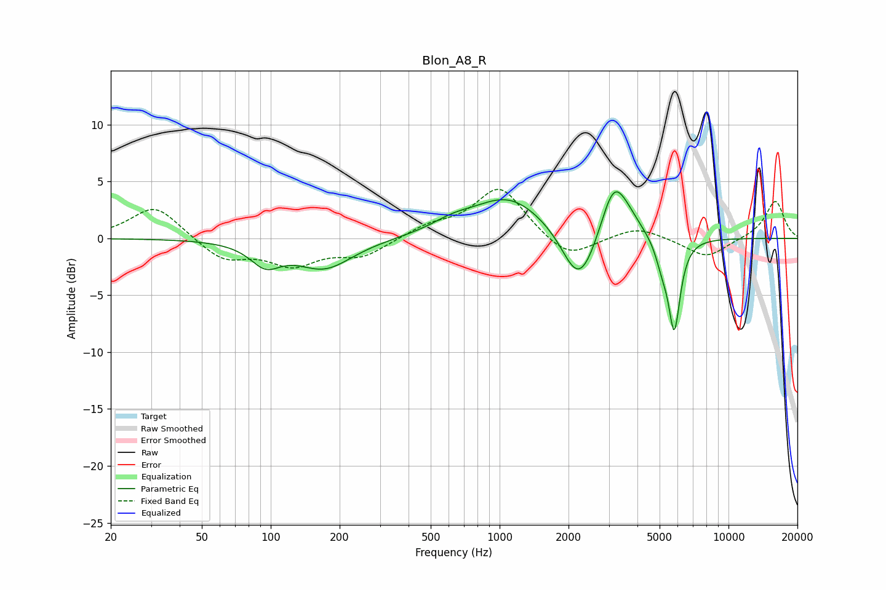

# Blon_A8_R
See [usage instructions](https://github.com/jaakkopasanen/AutoEq#usage) for more options and info.

### Parametric EQs
Apply preamp of -4.2 dB when using parametric equalizer.

|   # | Type    |   Fc (Hz) |    Q |   Gain (dB) |
|-----|---------|-----------|------|-------------|
|   1 | Peaking |        95 | 2.16 |        -1.9 |
|   2 | Peaking |       172 | 1.14 |        -2.6 |
|   3 | Peaking |       619 | 1.54 |         0.8 |
|   4 | Peaking |      1094 | 0.89 |         3.6 |
|   5 | Peaking |      2170 | 2.05 |        -3.7 |
|   6 | Peaking |      2402 | 2.17 |        -1.6 |
|   7 | Peaking |      3150 | 2.49 |         4.5 |
|   8 | Peaking |      3617 | 2.14 |         1.1 |
|   9 | Peaking |      5125 | 4.84 |        -1.7 |
|  10 | Peaking |      5798 | 5.35 |        -7.9 |

### Fixed Band EQs
When using fixed band (also called graphic) equalizer, apply preamp of **-4.4 dB** (if available) and set gains manually with these parameters.

|   # | Type    |   Fc (Hz) |    Q |   Gain (dB) |
|-----|---------|-----------|------|-------------|
|   1 | Peaking |        31 | 1.41 |         2.9 |
|   2 | Peaking |        62 | 1.41 |        -1.9 |
|   3 | Peaking |       125 | 1.41 |        -2.2 |
|   4 | Peaking |       250 | 1.41 |        -1.5 |
|   5 | Peaking |       500 | 1.41 |         1   |
|   6 | Peaking |      1000 | 1.41 |         4.5 |
|   7 | Peaking |      2000 | 1.41 |        -2   |
|   8 | Peaking |      4000 | 1.41 |         1.1 |
|   9 | Peaking |      8000 | 1.41 |        -1.7 |
|  10 | Peaking |     16000 | 1.41 |         3.3 |

### Graphs

