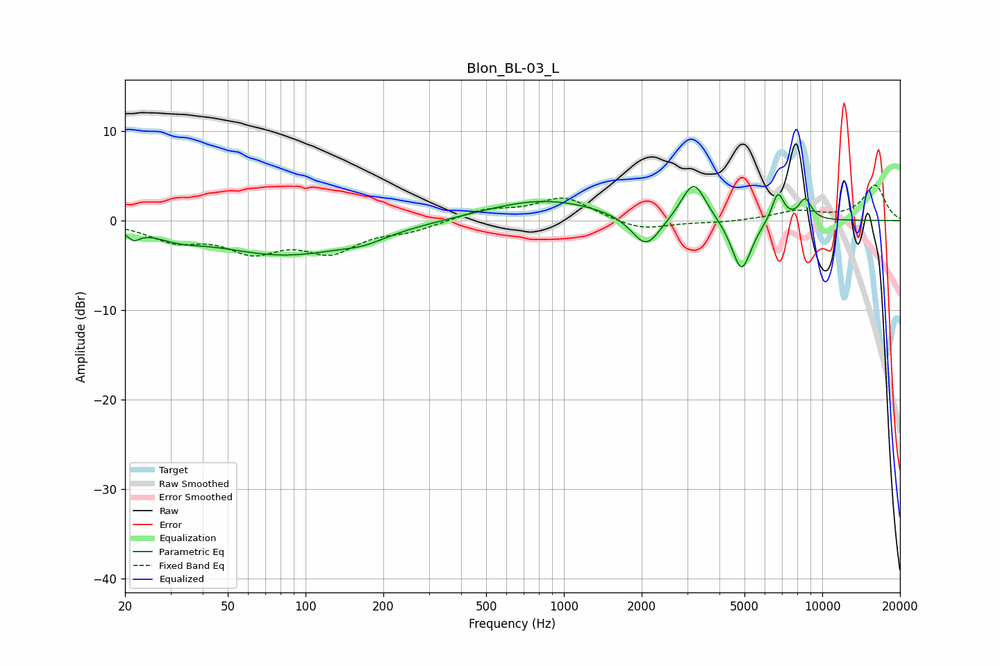

# Blon_BL-03_L
See [usage instructions](https://github.com/jaakkopasanen/AutoEq#usage) for more options and info.

### Parametric EQs
Apply preamp of -3.9 dB when using parametric equalizer.

|   # | Type    |   Fc (Hz) |    Q |   Gain (dB) |
|-----|---------|-----------|------|-------------|
|   1 | Peaking |        22 | 5.96 |        -1   |
|   2 | Peaking |        32 | 1.57 |        -0.9 |
|   3 | Peaking |        84 | 0.51 |        -3.8 |
|   4 | Peaking |       168 | 1.76 |        -0.7 |
|   5 | Peaking |       834 | 0.63 |         2.4 |
|   6 | Peaking |      2080 | 2.53 |        -3.7 |
|   7 | Peaking |      3181 | 2.99 |         4.5 |
|   8 | Peaking |      4870 | 3.58 |        -6   |
|   9 | Peaking |      6736 | 5.73 |         3.3 |
|  10 | Peaking |      8584 | 5.2  |         2.4 |

### Fixed Band EQs
When using fixed band (also called graphic) equalizer, apply preamp of **-4.0 dB** (if available) and set gains manually with these parameters.

|   # | Type    |   Fc (Hz) |    Q |   Gain (dB) |
|-----|---------|-----------|------|-------------|
|   1 | Peaking |        31 | 1.41 |        -2   |
|   2 | Peaking |        62 | 1.41 |        -3   |
|   3 | Peaking |       125 | 1.41 |        -3.1 |
|   4 | Peaking |       250 | 1.41 |        -1   |
|   5 | Peaking |       500 | 1.41 |         1.1 |
|   6 | Peaking |      1000 | 1.41 |         2.6 |
|   7 | Peaking |      2000 | 1.41 |        -1.2 |
|   8 | Peaking |      4000 | 1.41 |        -0.2 |
|   9 | Peaking |      8000 | 1.41 |         1   |
|  10 | Peaking |     16000 | 1.41 |         3.9 |

### Graphs

