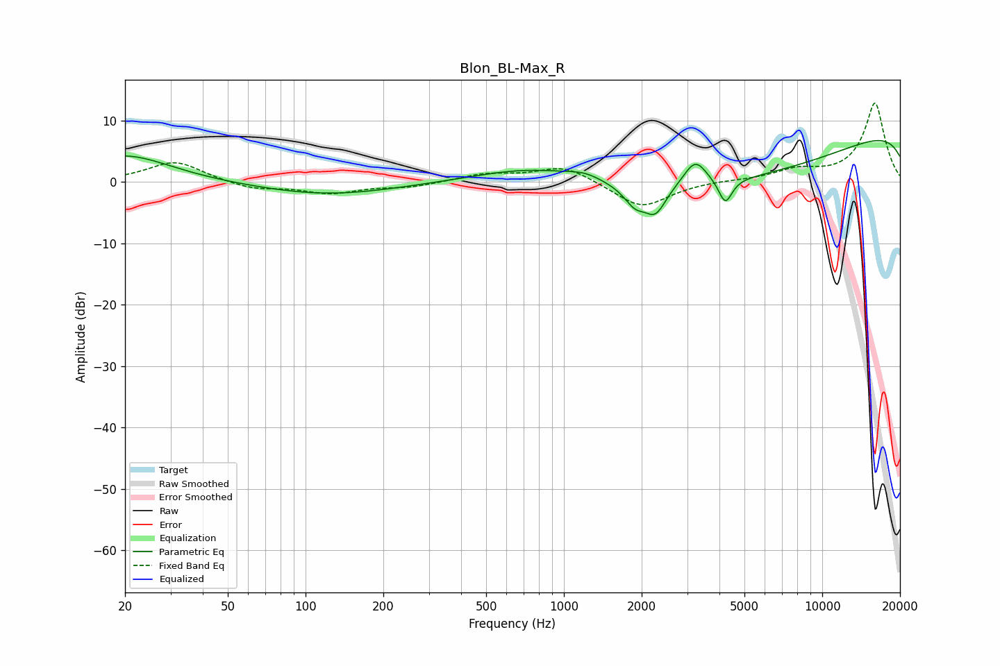

# Blon_BL-Max_R
See [usage instructions](https://github.com/jaakkopasanen/AutoEq#usage) for more options and info.

### Parametric EQs
Apply preamp of -6.8 dB when using parametric equalizer.

|   # | Type    |   Fc (Hz) |    Q |   Gain (dB) |
|-----|---------|-----------|------|-------------|
|   1 | Peaking |        20 | 0.81 |         4.4 |
|   2 | Peaking |       121 | 0.53 |        -2.1 |
|   3 | Peaking |       766 | 0.65 |         2.9 |
|   4 | Peaking |      1205 | 2    |         1.1 |
|   5 | Peaking |      1884 | 3.39 |        -2.9 |
|   6 | Peaking |      2262 | 3.42 |        -4.2 |
|   7 | Peaking |      3224 | 3.06 |         4.4 |
|   8 | Peaking |      4216 | 5.41 |        -4.1 |
|   9 | Peaking |      5566 | 0.24 |       -11.2 |
|  10 | Peaking |     10000 | 0.18 |        13.6 |

### Fixed Band EQs
When using fixed band (also called graphic) equalizer, apply preamp of **-12.9 dB** (if available) and set gains manually with these parameters.

|   # | Type    |   Fc (Hz) |    Q |   Gain (dB) |
|-----|---------|-----------|------|-------------|
|   1 | Peaking |        31 | 1.41 |         3.4 |
|   2 | Peaking |        62 | 1.41 |        -1.2 |
|   3 | Peaking |       125 | 1.41 |        -1.7 |
|   4 | Peaking |       250 | 1.41 |        -0.8 |
|   5 | Peaking |       500 | 1.41 |         1.2 |
|   6 | Peaking |      1000 | 1.41 |         2.6 |
|   7 | Peaking |      2000 | 1.41 |        -4.3 |
|   8 | Peaking |      4000 | 1.41 |         0.2 |
|   9 | Peaking |      8000 | 1.41 |         1.7 |
|  10 | Peaking |     16000 | 1.41 |        12.8 |

### Graphs

