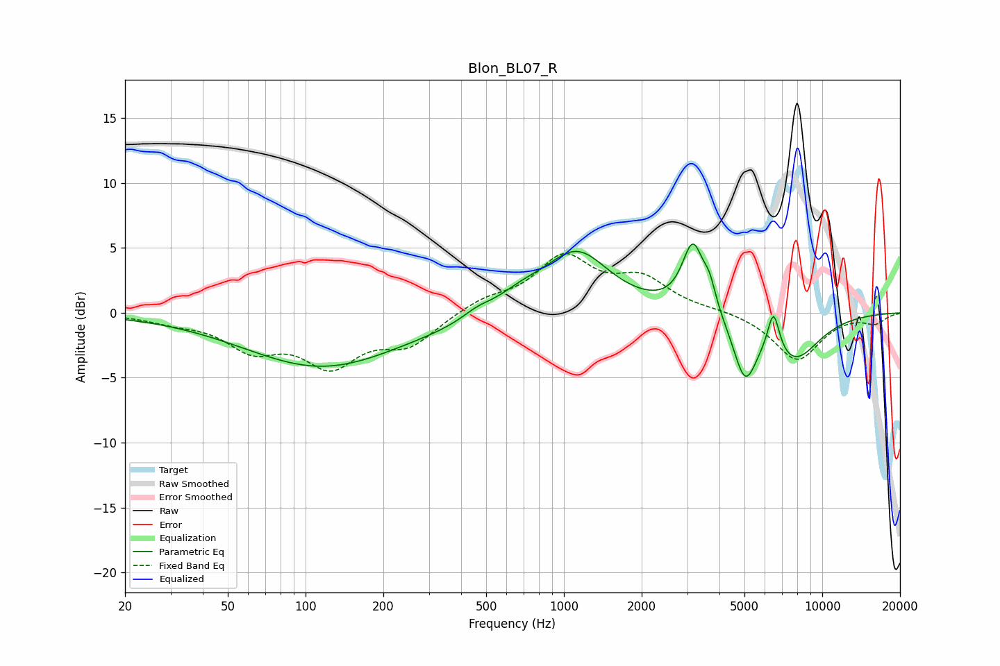

# Blon_BL07_R
See [usage instructions](https://github.com/jaakkopasanen/AutoEq#usage) for more options and info.

### Parametric EQs
Apply preamp of -5.4 dB when using parametric equalizer.

|   # | Type    |   Fc (Hz) |    Q |   Gain (dB) |
|-----|---------|-----------|------|-------------|
|   1 | Peaking |       116 | 0.47 |        -4.1 |
|   2 | Peaking |       348 | 0.97 |        -0.2 |
|   3 | Peaking |       462 | 2.49 |         0.5 |
|   4 | Peaking |       684 | 1.5  |         1   |
|   5 | Peaking |      1123 | 1.13 |         4.6 |
|   6 | Peaking |      3161 | 3.36 |         5.2 |
|   7 | Peaking |      3665 | 5.97 |         1.5 |
|   8 | Peaking |      5026 | 3.02 |        -4.6 |
|   9 | Peaking |      6477 | 5.96 |         3.2 |
|  10 | Peaking |      7768 | 1.31 |        -3.5 |

### Fixed Band EQs
When using fixed band (also called graphic) equalizer, apply preamp of **-4.7 dB** (if available) and set gains manually with these parameters.

|   # | Type    |   Fc (Hz) |    Q |   Gain (dB) |
|-----|---------|-----------|------|-------------|
|   1 | Peaking |        31 | 1.41 |        -0.5 |
|   2 | Peaking |        62 | 1.41 |        -2.5 |
|   3 | Peaking |       125 | 1.41 |        -3.7 |
|   4 | Peaking |       250 | 1.41 |        -2.3 |
|   5 | Peaking |       500 | 1.41 |         0.9 |
|   6 | Peaking |      1000 | 1.41 |         4.1 |
|   7 | Peaking |      2000 | 1.41 |         2.4 |
|   8 | Peaking |      4000 | 1.41 |         0.2 |
|   9 | Peaking |      8000 | 1.41 |        -3.7 |
|  10 | Peaking |     16000 | 1.41 |        -0.7 |

### Graphs

