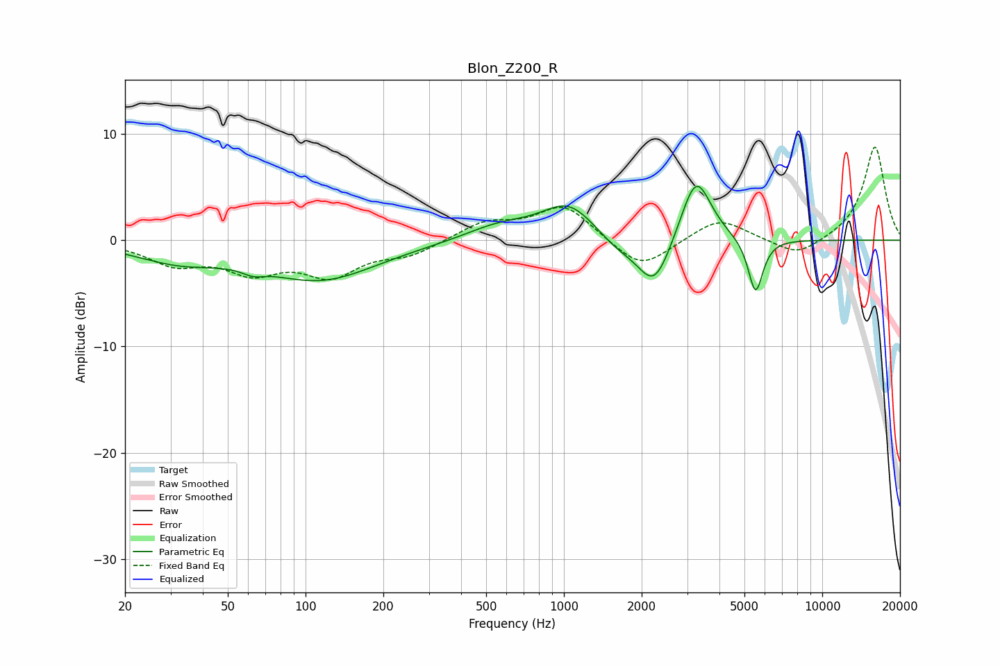

# Blon_Z200_R
See [usage instructions](https://github.com/jaakkopasanen/AutoEq#usage) for more options and info.

### Parametric EQs
Apply preamp of -5.2 dB when using parametric equalizer.

|   # | Type    |   Fc (Hz) |    Q |   Gain (dB) |
|-----|---------|-----------|------|-------------|
|   1 | Peaking |        32 | 0.82 |        -1.7 |
|   2 | Peaking |        63 | 3.45 |        -0.6 |
|   3 | Peaking |       115 | 0.65 |        -3.6 |
|   4 | Peaking |       557 | 1.08 |         1.3 |
|   5 | Peaking |      1049 | 1.31 |         3.5 |
|   6 | Peaking |      1604 | 1.55 |        -1.3 |
|   7 | Peaking |      2241 | 2.19 |        -4.7 |
|   8 | Peaking |      3223 | 2.26 |         1.1 |
|   9 | Peaking |      3250 | 2.44 |         5.2 |
|  10 | Peaking |      5519 | 4.85 |        -5.2 |

### Fixed Band EQs
When using fixed band (also called graphic) equalizer, apply preamp of **-8.9 dB** (if available) and set gains manually with these parameters.

|   # | Type    |   Fc (Hz) |    Q |   Gain (dB) |
|-----|---------|-----------|------|-------------|
|   1 | Peaking |        31 | 1.41 |        -2   |
|   2 | Peaking |        62 | 1.41 |        -2.6 |
|   3 | Peaking |       125 | 1.41 |        -3   |
|   4 | Peaking |       250 | 1.41 |        -1.2 |
|   5 | Peaking |       500 | 1.41 |         1.6 |
|   6 | Peaking |      1000 | 1.41 |         3.3 |
|   7 | Peaking |      2000 | 1.41 |        -2.9 |
|   8 | Peaking |      4000 | 1.41 |         2.2 |
|   9 | Peaking |      8000 | 1.41 |        -1.7 |
|  10 | Peaking |     16000 | 1.41 |         8.9 |

### Graphs

