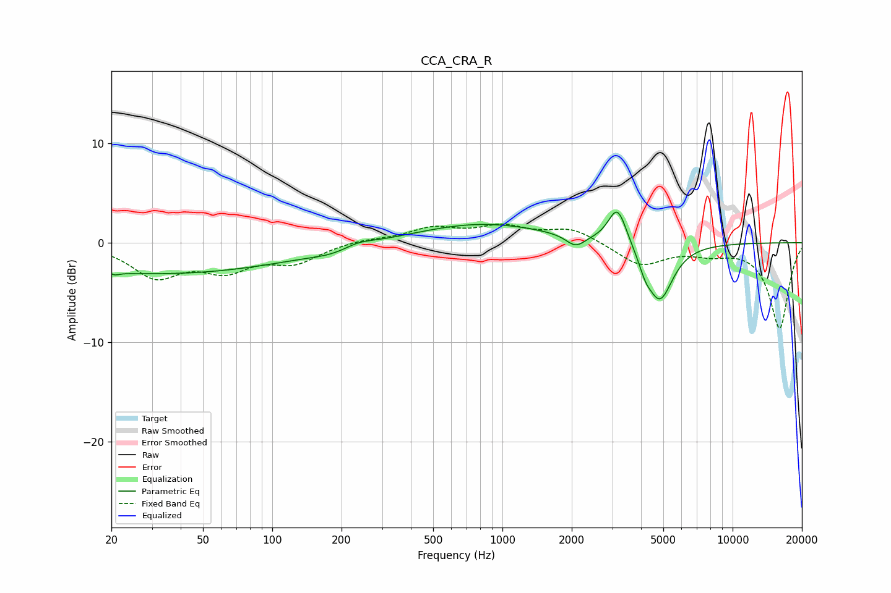

# CCA_CRA_R
See [usage instructions](https://github.com/jaakkopasanen/AutoEq#usage) for more options and info.

### Parametric EQs
Apply preamp of -3.2 dB when using parametric equalizer.

|   # | Type    |   Fc (Hz) |    Q |   Gain (dB) |
|-----|---------|-----------|------|-------------|
|   1 | Peaking |        20 | 5.92 |         2.6 |
|   2 | Peaking |        20 | 5.99 |        -2.8 |
|   3 | Peaking |        31 | 0.23 |        -3.1 |
|   4 | Peaking |       186 | 1.4  |        -0.5 |
|   5 | Peaking |       235 | 2.1  |         0.6 |
|   6 | Peaking |       809 | 0.5  |         1.9 |
|   7 | Peaking |      2079 | 3.45 |        -1.2 |
|   8 | Peaking |      3162 | 3.53 |         3.9 |
|   9 | Peaking |      4170 | 5.33 |        -1.1 |
|  10 | Peaking |      4822 | 2.42 |        -5.9 |

### Fixed Band EQs
When using fixed band (also called graphic) equalizer, apply preamp of **-2.0 dB** (if available) and set gains manually with these parameters.

|   # | Type    |   Fc (Hz) |    Q |   Gain (dB) |
|-----|---------|-----------|------|-------------|
|   1 | Peaking |        31 | 1.41 |        -3.2 |
|   2 | Peaking |        62 | 1.41 |        -2.4 |
|   3 | Peaking |       125 | 1.41 |        -1.8 |
|   4 | Peaking |       250 | 1.41 |         0.3 |
|   5 | Peaking |       500 | 1.41 |         1.4 |
|   6 | Peaking |      1000 | 1.41 |         1.5 |
|   7 | Peaking |      2000 | 1.41 |         1.4 |
|   8 | Peaking |      4000 | 1.41 |        -2.3 |
|   9 | Peaking |      8000 | 1.41 |        -0.8 |
|  10 | Peaking |     16000 | 1.41 |        -8.6 |

### Graphs

