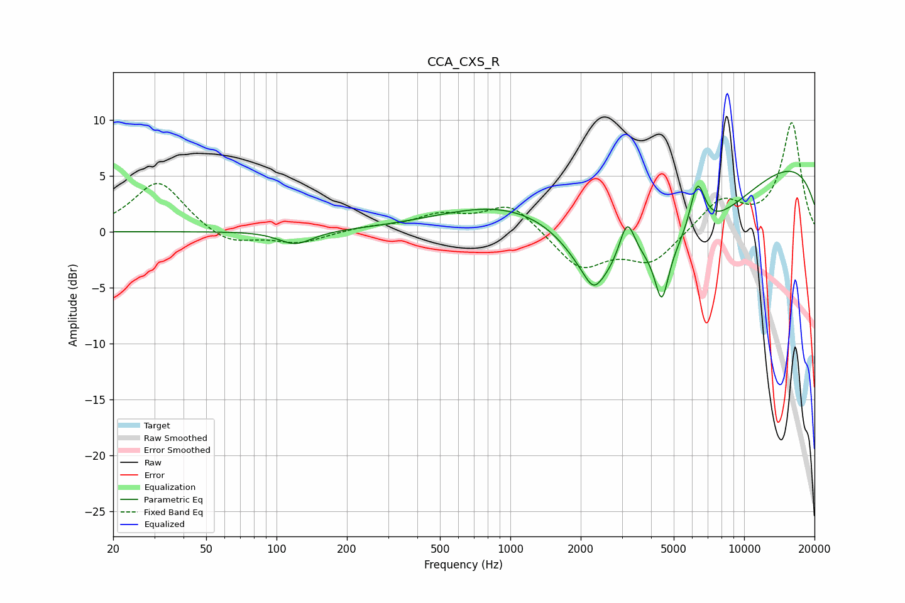

# CCA_CXS_R
See [usage instructions](https://github.com/jaakkopasanen/AutoEq#usage) for more options and info.

### Parametric EQs
Apply preamp of -5.5 dB when using parametric equalizer.

|   # | Type    |   Fc (Hz) |    Q |   Gain (dB) |
|-----|---------|-----------|------|-------------|
|   1 | Peaking |        98 | 1.11 |         0.1 |
|   2 | Peaking |       120 | 1.92 |        -1.3 |
|   3 | Peaking |       949 | 0.5  |         2.4 |
|   4 | Peaking |      2266 | 4.07 |        -1.2 |
|   5 | Peaking |      2300 | 1.27 |        -4.9 |
|   6 | Peaking |      3159 | 4.24 |         3.7 |
|   7 | Peaking |      4444 | 4.85 |        -4.8 |
|   8 | Peaking |      5293 | 0.46 |        -7.8 |
|   9 | Peaking |      6311 | 4.06 |         4.8 |
|  10 | Peaking |     10000 | 0.19 |         7.7 |

### Fixed Band EQs
When using fixed band (also called graphic) equalizer, apply preamp of **-9.8 dB** (if available) and set gains manually with these parameters.

|   # | Type    |   Fc (Hz) |    Q |   Gain (dB) |
|-----|---------|-----------|------|-------------|
|   1 | Peaking |        31 | 1.41 |         4.6 |
|   2 | Peaking |        62 | 1.41 |        -1.3 |
|   3 | Peaking |       125 | 1.41 |        -1   |
|   4 | Peaking |       250 | 1.41 |         0.4 |
|   5 | Peaking |       500 | 1.41 |         1.3 |
|   6 | Peaking |      1000 | 1.41 |         2.5 |
|   7 | Peaking |      2000 | 1.41 |        -3.3 |
|   8 | Peaking |      4000 | 1.41 |        -2.7 |
|   9 | Peaking |      8000 | 1.41 |         2.8 |
|  10 | Peaking |     16000 | 1.41 |         9.7 |

### Graphs

