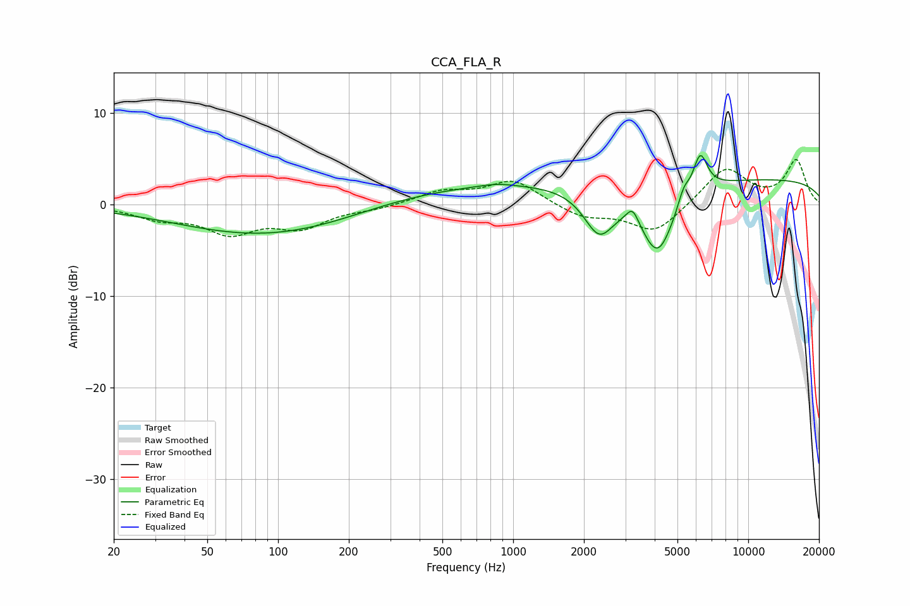

# CCA_FLA_R
See [usage instructions](https://github.com/jaakkopasanen/AutoEq#usage) for more options and info.

### Parametric EQs
Apply preamp of -5.5 dB when using parametric equalizer.

|   # | Type    |   Fc (Hz) |    Q |   Gain (dB) |
|-----|---------|-----------|------|-------------|
|   1 | Peaking |        92 | 0.37 |        -3.5 |
|   2 | Peaking |       177 | 1.48 |        -0   |
|   3 | Peaking |       704 | 0.28 |         2.1 |
|   4 | Peaking |       853 | 1.99 |         0.3 |
|   5 | Peaking |      2324 | 2.13 |        -4.9 |
|   6 | Peaking |      3223 | 5.62 |         1.6 |
|   7 | Peaking |      4122 | 1.91 |        -7.5 |
|   8 | Peaking |      5309 | 5.76 |         1.5 |
|   9 | Peaking |      6247 | 4.48 |         4.1 |
|  10 | Peaking |     10000 | 0.18 |         2.8 |

### Fixed Band EQs
When using fixed band (also called graphic) equalizer, apply preamp of **-5.0 dB** (if available) and set gains manually with these parameters.

|   # | Type    |   Fc (Hz) |    Q |   Gain (dB) |
|-----|---------|-----------|------|-------------|
|   1 | Peaking |        31 | 1.41 |        -1.3 |
|   2 | Peaking |        62 | 1.41 |        -2.8 |
|   3 | Peaking |       125 | 1.41 |        -2.3 |
|   4 | Peaking |       250 | 1.41 |        -0.4 |
|   5 | Peaking |       500 | 1.41 |         1.4 |
|   6 | Peaking |      1000 | 1.41 |         2.6 |
|   7 | Peaking |      2000 | 1.41 |        -1.4 |
|   8 | Peaking |      4000 | 1.41 |        -3.1 |
|   9 | Peaking |      8000 | 1.41 |         4.1 |
|  10 | Peaking |     16000 | 1.41 |         4.8 |

### Graphs

