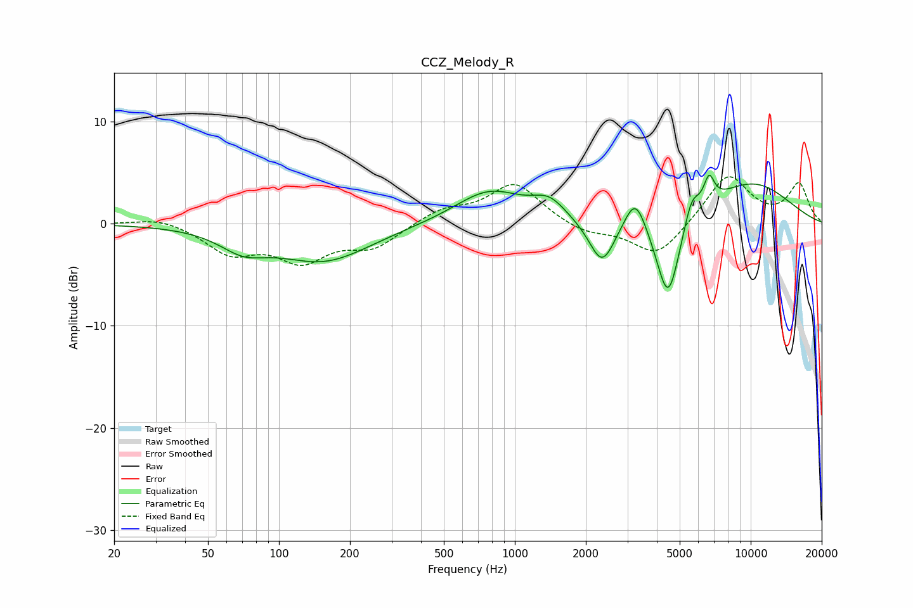

# CCZ_Melody_R
See [usage instructions](https://github.com/jaakkopasanen/AutoEq#usage) for more options and info.

### Parametric EQs
Apply preamp of -4.8 dB when using parametric equalizer.

|   # | Type    |   Fc (Hz) |    Q |   Gain (dB) |
|-----|---------|-----------|------|-------------|
|   1 | Peaking |        71 | 1.43 |        -1.8 |
|   2 | Peaking |       155 | 0.71 |        -3.6 |
|   3 | Peaking |       780 | 0.97 |         3.2 |
|   4 | Peaking |      1398 | 2.01 |         1.8 |
|   5 | Peaking |      2343 | 2.56 |        -4.5 |
|   6 | Peaking |      3242 | 3.11 |         3.5 |
|   7 | Peaking |      4465 | 2.71 |        -8.6 |
|   8 | Peaking |      5615 | 4.34 |         2.5 |
|   9 | Peaking |      6661 | 6    |         2.6 |
|  10 | Peaking |     10000 | 0.63 |         4   |

### Fixed Band EQs
When using fixed band (also called graphic) equalizer, apply preamp of **-4.7 dB** (if available) and set gains manually with these parameters.

|   # | Type    |   Fc (Hz) |    Q |   Gain (dB) |
|-----|---------|-----------|------|-------------|
|   1 | Peaking |        31 | 1.41 |         0.7 |
|   2 | Peaking |        62 | 1.41 |        -2.7 |
|   3 | Peaking |       125 | 1.41 |        -3.3 |
|   4 | Peaking |       250 | 1.41 |        -2.2 |
|   5 | Peaking |       500 | 1.41 |         1.3 |
|   6 | Peaking |      1000 | 1.41 |         3.9 |
|   7 | Peaking |      2000 | 1.41 |        -1   |
|   8 | Peaking |      4000 | 1.41 |        -3.3 |
|   9 | Peaking |      8000 | 1.41 |         4.8 |
|  10 | Peaking |     16000 | 1.41 |         3.8 |

### Graphs

