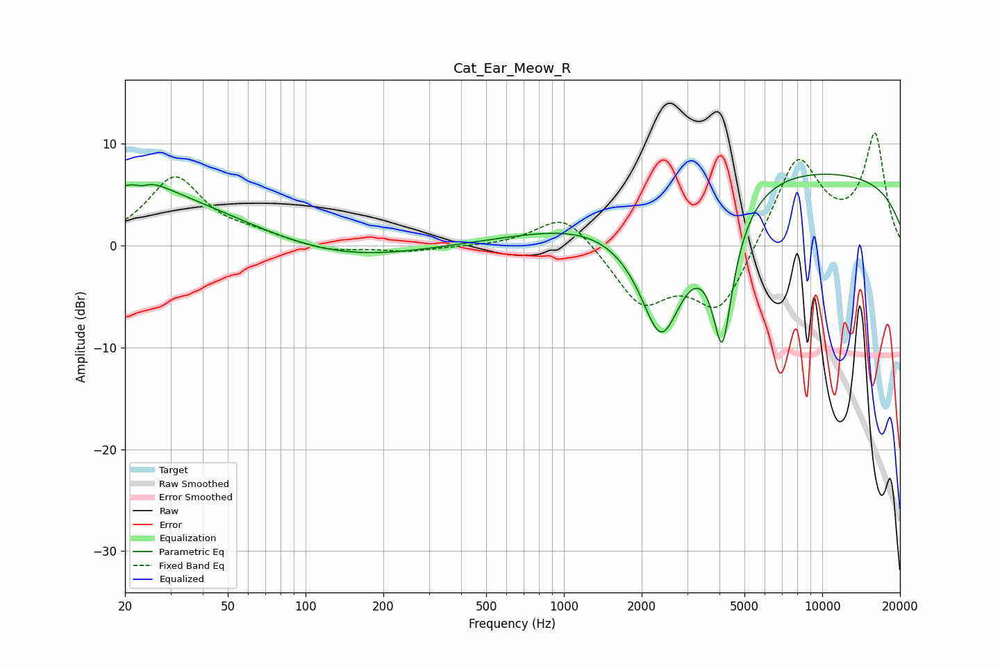

# Cat_Ear_Meow_R
See [usage instructions](https://github.com/jaakkopasanen/AutoEq#usage) for more options and info.

### Parametric EQs
Apply preamp of -7.1 dB when using parametric equalizer.

|   # | Type    |   Fc (Hz) |    Q |   Gain (dB) |
|-----|---------|-----------|------|-------------|
|   1 | Peaking |        23 | 0.41 |         5.2 |
|   2 | Peaking |        23 | 5.98 |         2   |
|   3 | Peaking |        23 | 5.82 |        -2.5 |
|   4 | Peaking |        24 | 1.69 |         1.3 |
|   5 | Peaking |       142 | 0.52 |        -1.4 |
|   6 | Peaking |      2359 | 0.32 |         2.7 |
|   7 | Peaking |      2371 | 2.38 |        -4.1 |
|   8 | Peaking |      2409 | 1.11 |       -10.2 |
|   9 | Peaking |      4106 | 3.24 |       -13.4 |
|  10 | Peaking |      9167 | 0.18 |         7   |

### Fixed Band EQs
When using fixed band (also called graphic) equalizer, apply preamp of **-11.1 dB** (if available) and set gains manually with these parameters.

|   # | Type    |   Fc (Hz) |    Q |   Gain (dB) |
|-----|---------|-----------|------|-------------|
|   1 | Peaking |        31 | 1.41 |         6.6 |
|   2 | Peaking |        62 | 1.41 |         0.8 |
|   3 | Peaking |       125 | 1.41 |        -0.6 |
|   4 | Peaking |       250 | 1.41 |        -0.6 |
|   5 | Peaking |       500 | 1.41 |        -0.1 |
|   6 | Peaking |      1000 | 1.41 |         3.4 |
|   7 | Peaking |      2000 | 1.41 |        -5.5 |
|   8 | Peaking |      4000 | 1.41 |        -6.6 |
|   9 | Peaking |      8000 | 1.41 |         8.9 |
|  10 | Peaking |     16000 | 1.41 |        10.7 |

### Graphs

