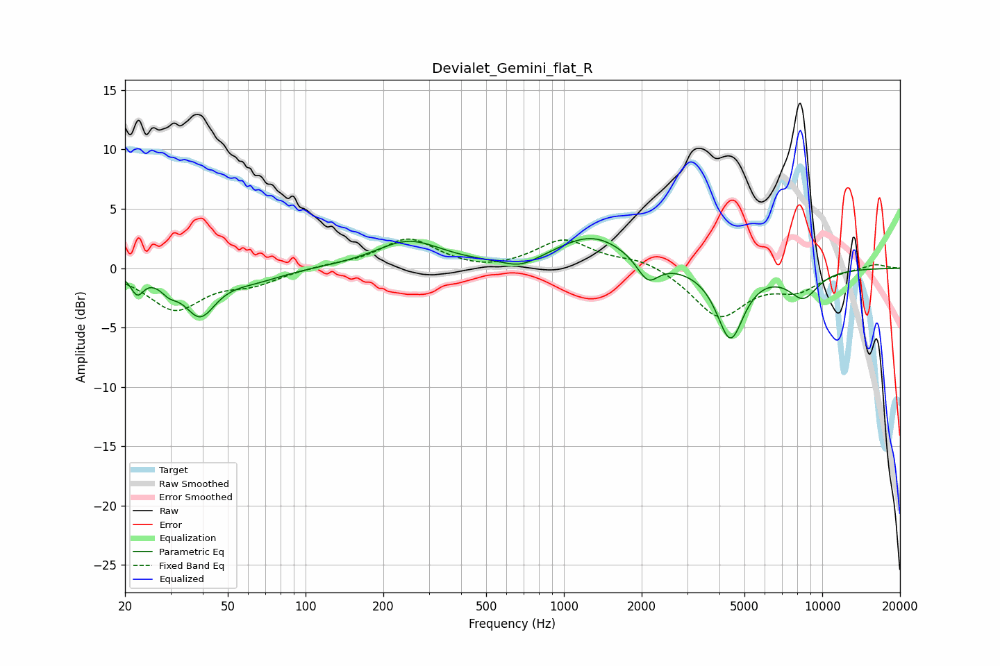

# Devialet_Gemini_flat_R
See [usage instructions](https://github.com/jaakkopasanen/AutoEq#usage) for more options and info.

### Parametric EQs
Apply preamp of -2.6 dB when using parametric equalizer.

|   # | Type    |   Fc (Hz) |    Q |   Gain (dB) |
|-----|---------|-----------|------|-------------|
|   1 | Peaking |        22 | 5.78 |        -1.6 |
|   2 | Peaking |        30 | 4.23 |        -0.9 |
|   3 | Peaking |        39 | 2.32 |        -3.6 |
|   4 | Peaking |        63 | 1.22 |        -0.9 |
|   5 | Peaking |       250 | 1.1  |         2.2 |
|   6 | Peaking |       681 | 2.07 |        -0.8 |
|   7 | Peaking |      1294 | 1.01 |         2.7 |
|   8 | Peaking |      2114 | 3.41 |        -2   |
|   9 | Peaking |      4409 | 2.69 |        -5.9 |
|  10 | Peaking |      8444 | 2.25 |        -2.3 |

### Fixed Band EQs
When using fixed band (also called graphic) equalizer, apply preamp of **-2.6 dB** (if available) and set gains manually with these parameters.

|   # | Type    |   Fc (Hz) |    Q |   Gain (dB) |
|-----|---------|-----------|------|-------------|
|   1 | Peaking |        31 | 1.41 |        -3.4 |
|   2 | Peaking |        62 | 1.41 |        -1.1 |
|   3 | Peaking |       125 | 1.41 |         0.2 |
|   4 | Peaking |       250 | 1.41 |         2.5 |
|   5 | Peaking |       500 | 1.41 |        -0.4 |
|   6 | Peaking |      1000 | 1.41 |         2.4 |
|   7 | Peaking |      2000 | 1.41 |         0.8 |
|   8 | Peaking |      4000 | 1.41 |        -4.1 |
|   9 | Peaking |      8000 | 1.41 |        -1.6 |
|  10 | Peaking |     16000 | 1.41 |         0.4 |

### Graphs

