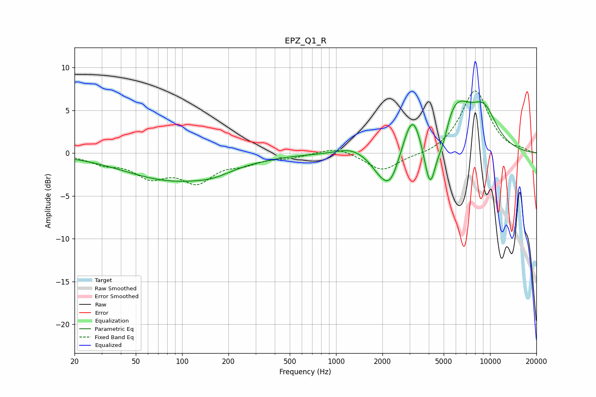

# EPZ_Q1_R
See [usage instructions](https://github.com/jaakkopasanen/AutoEq#usage) for more options and info.

### Parametric EQs
Apply preamp of -6.2 dB when using parametric equalizer.

|   # | Type    |   Fc (Hz) |    Q |   Gain (dB) |
|-----|---------|-----------|------|-------------|
|   1 | Peaking |        88 | 0.44 |        -3.1 |
|   2 | Peaking |       159 | 1.26 |        -0.6 |
|   3 | Peaking |      1238 | 1.64 |         0.7 |
|   4 | Peaking |      1889 | 2.35 |        -1.2 |
|   5 | Peaking |      2247 | 2.28 |        -3.9 |
|   6 | Peaking |      3132 | 2.48 |         4.7 |
|   7 | Peaking |      4080 | 3.46 |        -6.7 |
|   8 | Peaking |      4941 | 3.38 |        -2.5 |
|   9 | Peaking |      5855 | 1.27 |         5.9 |
|  10 | Peaking |      9142 | 1.46 |         4   |

### Fixed Band EQs
When using fixed band (also called graphic) equalizer, apply preamp of **-7.4 dB** (if available) and set gains manually with these parameters.

|   # | Type    |   Fc (Hz) |    Q |   Gain (dB) |
|-----|---------|-----------|------|-------------|
|   1 | Peaking |        31 | 1.41 |        -1   |
|   2 | Peaking |        62 | 1.41 |        -2.4 |
|   3 | Peaking |       125 | 1.41 |        -3   |
|   4 | Peaking |       250 | 1.41 |        -0.9 |
|   5 | Peaking |       500 | 1.41 |        -0.4 |
|   6 | Peaking |      1000 | 1.41 |         0.8 |
|   7 | Peaking |      2000 | 1.41 |        -2.1 |
|   8 | Peaking |      4000 | 1.41 |        -0.4 |
|   9 | Peaking |      8000 | 1.41 |         7.4 |
|  10 | Peaking |     16000 | 1.41 |         0.3 |

### Graphs

