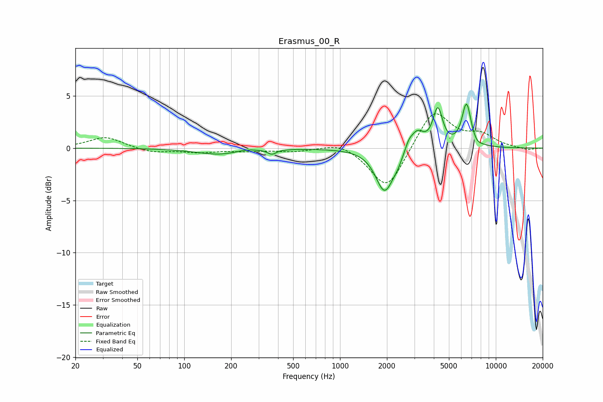

# Erasmus_00_R
See [usage instructions](https://github.com/jaakkopasanen/AutoEq#usage) for more options and info.

### Parametric EQs
Apply preamp of -4.3 dB when using parametric equalizer.

|   # | Type    |   Fc (Hz) |    Q |   Gain (dB) |
|-----|---------|-----------|------|-------------|
|   1 | Peaking |       171 | 0.95 |        -0.6 |
|   2 | Peaking |       248 | 1.9  |         0.2 |
|   3 | Peaking |       366 | 5.15 |        -0.5 |
|   4 | Peaking |      1934 | 2.48 |        -4.1 |
|   5 | Peaking |      2338 | 4.61 |        -0.5 |
|   6 | Peaking |      2761 | 6    |         0.7 |
|   7 | Peaking |      3120 | 3.33 |         1.7 |
|   8 | Peaking |      4240 | 4.6  |         3.6 |
|   9 | Peaking |      6483 | 4.67 |         4.1 |
|  10 | Peaking |      7542 | 5.39 |        -0.3 |

### Fixed Band EQs
When using fixed band (also called graphic) equalizer, apply preamp of **-3.4 dB** (if available) and set gains manually with these parameters.

|   # | Type    |   Fc (Hz) |    Q |   Gain (dB) |
|-----|---------|-----------|------|-------------|
|   1 | Peaking |        31 | 1.41 |         1.1 |
|   2 | Peaking |        62 | 1.41 |        -0.4 |
|   3 | Peaking |       125 | 1.41 |        -0.4 |
|   4 | Peaking |       250 | 1.41 |        -0.2 |
|   5 | Peaking |       500 | 1.41 |        -0.3 |
|   6 | Peaking |      1000 | 1.41 |         0.6 |
|   7 | Peaking |      2000 | 1.41 |        -4.1 |
|   8 | Peaking |      4000 | 1.41 |         3.8 |
|   9 | Peaking |      8000 | 1.41 |         1.1 |
|  10 | Peaking |     16000 | 1.41 |        -0.2 |

### Graphs

