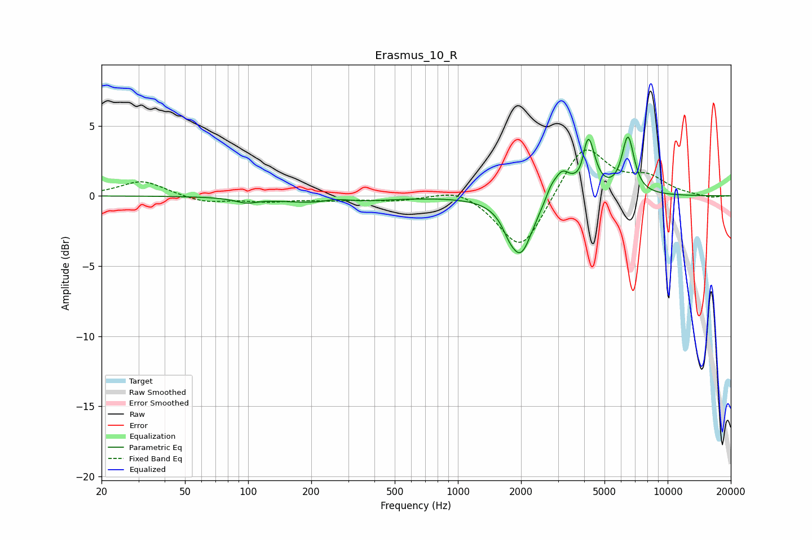

# Erasmus_10_R
See [usage instructions](https://github.com/jaakkopasanen/AutoEq#usage) for more options and info.

### Parametric EQs
Apply preamp of -4.3 dB when using parametric equalizer.

|   # | Type    |   Fc (Hz) |    Q |   Gain (dB) |
|-----|---------|-----------|------|-------------|
|   1 | Peaking |        98 | 2.72 |        -0.3 |
|   2 | Peaking |       245 | 0.75 |        -0.7 |
|   3 | Peaking |       265 | 1.96 |         0.4 |
|   4 | Peaking |      1745 | 4.79 |        -0.5 |
|   5 | Peaking |      1991 | 2.47 |        -4.1 |
|   6 | Peaking |      2774 | 5.77 |         0.6 |
|   7 | Peaking |      3131 | 3.6  |         1.7 |
|   8 | Peaking |      3903 | 6    |        -0.8 |
|   9 | Peaking |      4168 | 4.52 |         4.3 |
|  10 | Peaking |      6470 | 4.72 |         4   |

### Fixed Band EQs
When using fixed band (also called graphic) equalizer, apply preamp of **-3.4 dB** (if available) and set gains manually with these parameters.

|   # | Type    |   Fc (Hz) |    Q |   Gain (dB) |
|-----|---------|-----------|------|-------------|
|   1 | Peaking |        31 | 1.41 |         1.1 |
|   2 | Peaking |        62 | 1.41 |        -0.5 |
|   3 | Peaking |       125 | 1.41 |        -0.3 |
|   4 | Peaking |       250 | 1.41 |        -0.2 |
|   5 | Peaking |       500 | 1.41 |        -0.3 |
|   6 | Peaking |      1000 | 1.41 |         0.7 |
|   7 | Peaking |      2000 | 1.41 |        -4.1 |
|   8 | Peaking |      4000 | 1.41 |         3.8 |
|   9 | Peaking |      8000 | 1.41 |         1.2 |
|  10 | Peaking |     16000 | 1.41 |        -0.2 |

### Graphs

