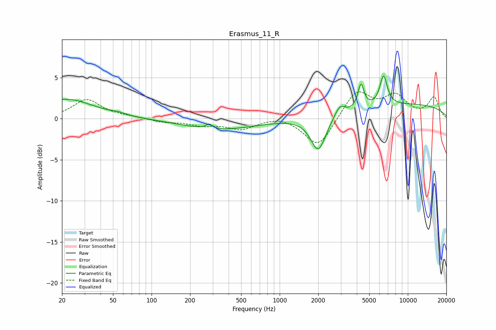

# Erasmus_11_R
See [usage instructions](https://github.com/jaakkopasanen/AutoEq#usage) for more options and info.

### Parametric EQs
Apply preamp of -5.3 dB when using parametric equalizer.

|   # | Type    |   Fc (Hz) |    Q |   Gain (dB) |
|-----|---------|-----------|------|-------------|
|   1 | Peaking |        22 | 0.69 |         2.4 |
|   2 | Peaking |        55 | 2.38 |         0.2 |
|   3 | Peaking |       281 | 5.78 |         0.6 |
|   4 | Peaking |       339 | 0.5  |        -1.3 |
|   5 | Peaking |      2002 | 2.41 |        -4.2 |
|   6 | Peaking |      2897 | 3.76 |         0.9 |
|   7 | Peaking |      3022 | 4.09 |         0.4 |
|   8 | Peaking |      4310 | 6    |         2.9 |
|   9 | Peaking |      6465 | 4.74 |         3.6 |
|  10 | Peaking |     10000 | 0.25 |         1.7 |

### Fixed Band EQs
When using fixed band (also called graphic) equalizer, apply preamp of **-3.4 dB** (if available) and set gains manually with these parameters.

|   # | Type    |   Fc (Hz) |    Q |   Gain (dB) |
|-----|---------|-----------|------|-------------|
|   1 | Peaking |        31 | 1.41 |         2.3 |
|   2 | Peaking |        62 | 1.41 |         0.2 |
|   3 | Peaking |       125 | 1.41 |        -0.4 |
|   4 | Peaking |       250 | 1.41 |        -0.7 |
|   5 | Peaking |       500 | 1.41 |        -1.2 |
|   6 | Peaking |      1000 | 1.41 |         0.4 |
|   7 | Peaking |      2000 | 1.41 |        -3.6 |
|   8 | Peaking |      4000 | 1.41 |         3.4 |
|   9 | Peaking |      8000 | 1.41 |         2.6 |
|  10 | Peaking |     16000 | 1.41 |         2.5 |

### Graphs

