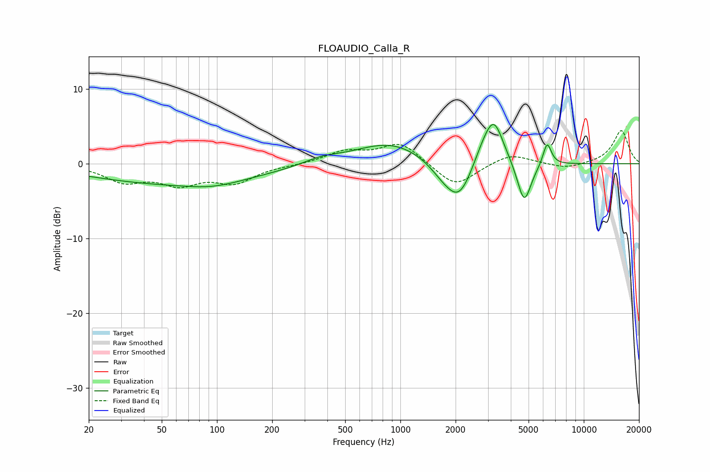

# FLOAUDIO_Calla_R
See [usage instructions](https://github.com/jaakkopasanen/AutoEq#usage) for more options and info.

### Parametric EQs
Apply preamp of -5.3 dB when using parametric equalizer.

|   # | Type    |   Fc (Hz) |    Q |   Gain (dB) |
|-----|---------|-----------|------|-------------|
|   1 | Peaking |        58 | 0.3  |        -2.6 |
|   2 | Peaking |        96 | 0.98 |        -0.7 |
|   3 | Peaking |       370 | 1.5  |         0.7 |
|   4 | Peaking |       887 | 0.71 |         2.9 |
|   5 | Peaking |      1714 | 1.79 |        -1.5 |
|   6 | Peaking |      2096 | 1.88 |        -4.9 |
|   7 | Peaking |      2801 | 2.56 |         1.7 |
|   8 | Peaking |      3237 | 2.61 |         5.8 |
|   9 | Peaking |      4732 | 3.62 |        -5.7 |
|  10 | Peaking |      6314 | 6    |         3.1 |

### Fixed Band EQs
When using fixed band (also called graphic) equalizer, apply preamp of **-4.5 dB** (if available) and set gains manually with these parameters.

|   # | Type    |   Fc (Hz) |    Q |   Gain (dB) |
|-----|---------|-----------|------|-------------|
|   1 | Peaking |        31 | 1.41 |        -2.2 |
|   2 | Peaking |        62 | 1.41 |        -2.4 |
|   3 | Peaking |       125 | 1.41 |        -2.3 |
|   4 | Peaking |       250 | 1.41 |        -0.1 |
|   5 | Peaking |       500 | 1.41 |         1.6 |
|   6 | Peaking |      1000 | 1.41 |         2.8 |
|   7 | Peaking |      2000 | 1.41 |        -3.2 |
|   8 | Peaking |      4000 | 1.41 |         1.4 |
|   9 | Peaking |      8000 | 1.41 |        -0.7 |
|  10 | Peaking |     16000 | 1.41 |         4.5 |

### Graphs

