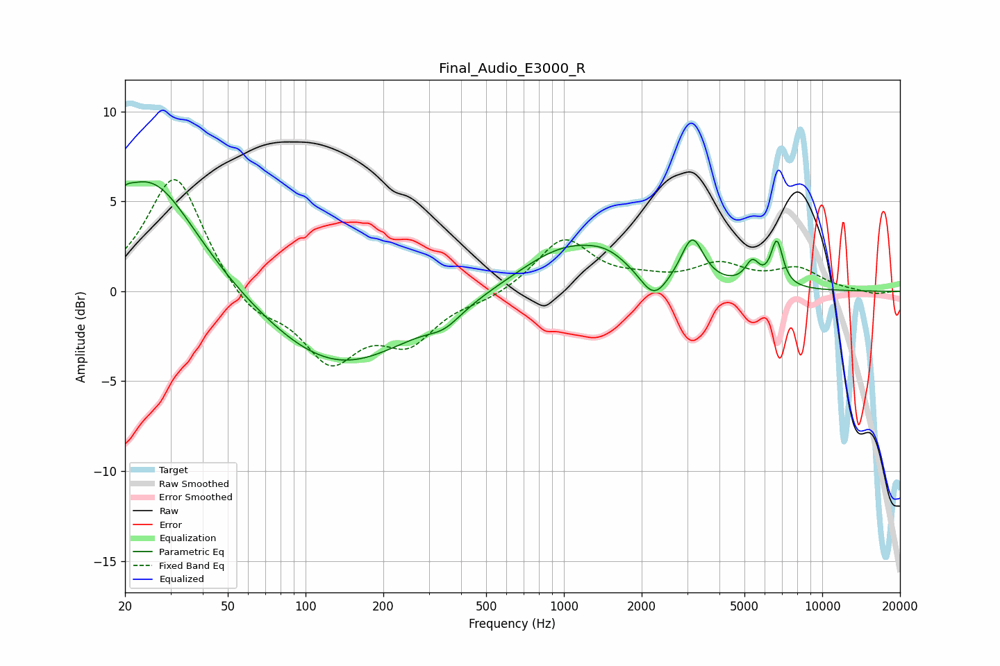

# Final_Audio_E3000_R
See [usage instructions](https://github.com/jaakkopasanen/AutoEq#usage) for more options and info.

### Parametric EQs
Apply preamp of -6.2 dB when using parametric equalizer.

|   # | Type    |   Fc (Hz) |    Q |   Gain (dB) |
|-----|---------|-----------|------|-------------|
|   1 | Peaking |        20 | 5.2  |         0.5 |
|   2 | Peaking |        25 | 0.79 |         6.5 |
|   3 | Peaking |       134 | 0.5  |        -4.2 |
|   4 | Peaking |       345 | 2.12 |        -0.7 |
|   5 | Peaking |      1047 | 0.74 |         2.6 |
|   6 | Peaking |      1485 | 1.79 |         0.6 |
|   7 | Peaking |      2229 | 2.69 |        -1.5 |
|   8 | Peaking |      3141 | 3.26 |         2.6 |
|   9 | Peaking |      5364 | 4.99 |         1.2 |
|  10 | Peaking |      6673 | 5.78 |         2.5 |

### Fixed Band EQs
When using fixed band (also called graphic) equalizer, apply preamp of **-6.3 dB** (if available) and set gains manually with these parameters.

|   # | Type    |   Fc (Hz) |    Q |   Gain (dB) |
|-----|---------|-----------|------|-------------|
|   1 | Peaking |        31 | 1.41 |         6.6 |
|   2 | Peaking |        62 | 1.41 |        -1.4 |
|   3 | Peaking |       125 | 1.41 |        -3.7 |
|   4 | Peaking |       250 | 1.41 |        -2.5 |
|   5 | Peaking |       500 | 1.41 |        -0.4 |
|   6 | Peaking |      1000 | 1.41 |         2.9 |
|   7 | Peaking |      2000 | 1.41 |         0.4 |
|   8 | Peaking |      4000 | 1.41 |         1.3 |
|   9 | Peaking |      8000 | 1.41 |         1.2 |
|  10 | Peaking |     16000 | 1.41 |        -0.2 |

### Graphs

