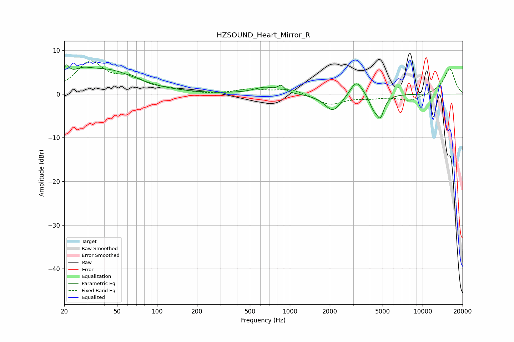

# HZSOUND_Heart_Mirror_R
See [usage instructions](https://github.com/jaakkopasanen/AutoEq#usage) for more options and info.

### Parametric EQs
Apply preamp of -6.7 dB when using parametric equalizer.

|   # | Type    |   Fc (Hz) |    Q |   Gain (dB) |
|-----|---------|-----------|------|-------------|
|   1 | Peaking |        21 | 5.98 |         3.1 |
|   2 | Peaking |        27 | 1.9  |         2.1 |
|   3 | Peaking |        43 | 0.65 |         5.1 |
|   4 | Peaking |       655 | 1.71 |         1.6 |
|   5 | Peaking |       806 | 1.77 |        -0.2 |
|   6 | Peaking |       860 | 5.9  |         1.5 |
|   7 | Peaking |      2115 | 2.25 |        -4   |
|   8 | Peaking |      3170 | 3.07 |         3.7 |
|   9 | Peaking |      4261 | 4.55 |        -2.6 |
|  10 | Peaking |      4803 | 5    |        -4.6 |

### Fixed Band EQs
When using fixed band (also called graphic) equalizer, apply preamp of **-7.7 dB** (if available) and set gains manually with these parameters.

|   # | Type    |   Fc (Hz) |    Q |   Gain (dB) |
|-----|---------|-----------|------|-------------|
|   1 | Peaking |        31 | 1.41 |         7   |
|   2 | Peaking |        62 | 1.41 |         2.9 |
|   3 | Peaking |       125 | 1.41 |         0.7 |
|   4 | Peaking |       250 | 1.41 |        -0.2 |
|   5 | Peaking |       500 | 1.41 |         1   |
|   6 | Peaking |      1000 | 1.41 |         1.2 |
|   7 | Peaking |      2000 | 1.41 |        -2.4 |
|   8 | Peaking |      4000 | 1.41 |        -0.7 |
|   9 | Peaking |      8000 | 1.41 |        -1.5 |
|  10 | Peaking |     16000 | 1.41 |         5.8 |

### Graphs

