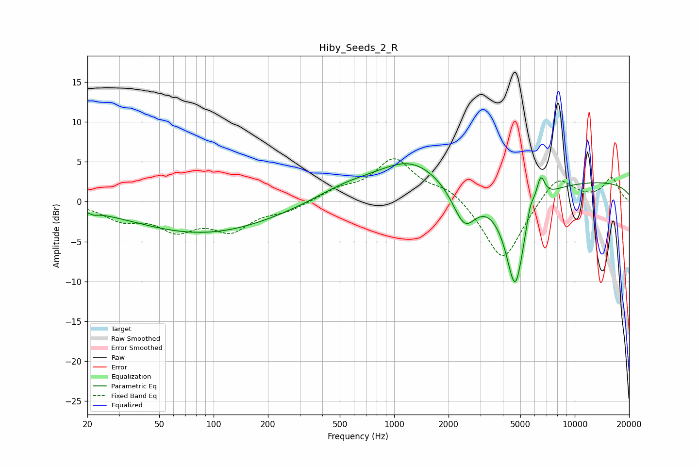

# Hiby_Seeds_2_R
See [usage instructions](https://github.com/jaakkopasanen/AutoEq#usage) for more options and info.

### Parametric EQs
Apply preamp of -4.9 dB when using parametric equalizer.

|   # | Type    |   Fc (Hz) |    Q |   Gain (dB) |
|-----|---------|-----------|------|-------------|
|   1 | Peaking |        22 | 5.89 |        -0.3 |
|   2 | Peaking |        63 | 0.39 |        -0   |
|   3 | Peaking |        88 | 0.36 |        -3.9 |
|   4 | Peaking |       545 | 0.79 |         1.6 |
|   5 | Peaking |      1235 | 0.75 |         4.4 |
|   6 | Peaking |      2451 | 2.12 |        -5   |
|   7 | Peaking |      4683 | 2.45 |       -12.9 |
|   8 | Peaking |      5665 | 5.82 |         2.3 |
|   9 | Peaking |      6475 | 5.76 |         3.3 |
|  10 | Peaking |      9968 | 0.18 |         2.6 |

### Fixed Band EQs
When using fixed band (also called graphic) equalizer, apply preamp of **-5.5 dB** (if available) and set gains manually with these parameters.

|   # | Type    |   Fc (Hz) |    Q |   Gain (dB) |
|-----|---------|-----------|------|-------------|
|   1 | Peaking |        31 | 1.41 |        -2   |
|   2 | Peaking |        62 | 1.41 |        -3.1 |
|   3 | Peaking |       125 | 1.41 |        -3.2 |
|   4 | Peaking |       250 | 1.41 |        -1   |
|   5 | Peaking |       500 | 1.41 |         1.3 |
|   6 | Peaking |      1000 | 1.41 |         5.2 |
|   7 | Peaking |      2000 | 1.41 |         1.7 |
|   8 | Peaking |      4000 | 1.41 |        -7.8 |
|   9 | Peaking |      8000 | 1.41 |         3.5 |
|  10 | Peaking |     16000 | 1.41 |         2.9 |

### Graphs

