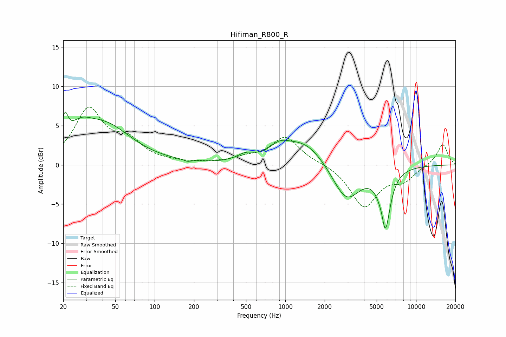

# Hifiman_R800_R
See [usage instructions](https://github.com/jaakkopasanen/AutoEq#usage) for more options and info.

### Parametric EQs
Apply preamp of -6.8 dB when using parametric equalizer.

|   # | Type    |   Fc (Hz) |    Q |   Gain (dB) |
|-----|---------|-----------|------|-------------|
|   1 | Peaking |        21 | 6    |         3.1 |
|   2 | Peaking |        27 | 1.66 |         2.2 |
|   3 | Peaking |        41 | 0.69 |         4.8 |
|   4 | Peaking |       178 | 6    |        -0.2 |
|   5 | Peaking |       496 | 2.21 |         0.8 |
|   6 | Peaking |       901 | 1.94 |         1.3 |
|   7 | Peaking |      1394 | 0.88 |         3.1 |
|   8 | Peaking |      2922 | 1.31 |        -4.8 |
|   9 | Peaking |      5541 | 6    |         1.6 |
|  10 | Peaking |      5772 | 3.65 |        -8.6 |

### Fixed Band EQs
When using fixed band (also called graphic) equalizer, apply preamp of **-7.5 dB** (if available) and set gains manually with these parameters.

|   # | Type    |   Fc (Hz) |    Q |   Gain (dB) |
|-----|---------|-----------|------|-------------|
|   1 | Peaking |        31 | 1.41 |         6.9 |
|   2 | Peaking |        62 | 1.41 |         2.6 |
|   3 | Peaking |       125 | 1.41 |         0.2 |
|   4 | Peaking |       250 | 1.41 |         0.2 |
|   5 | Peaking |       500 | 1.41 |         0.7 |
|   6 | Peaking |      1000 | 1.41 |         3.5 |
|   7 | Peaking |      2000 | 1.41 |         0.2 |
|   8 | Peaking |      4000 | 1.41 |        -5.3 |
|   9 | Peaking |      8000 | 1.41 |        -1.7 |
|  10 | Peaking |     16000 | 1.41 |         2.7 |

### Graphs

