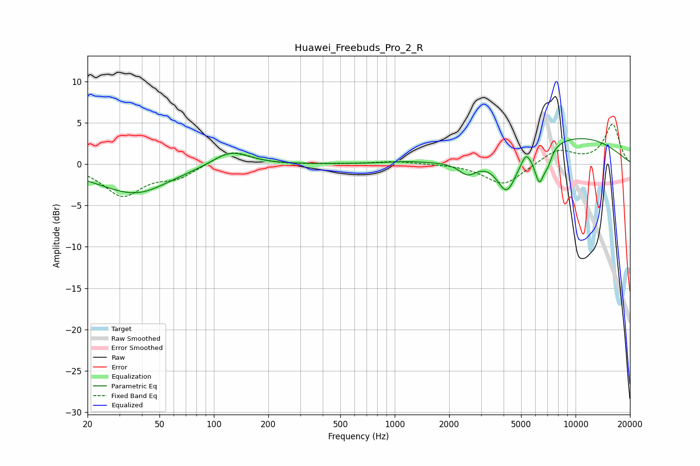

# Huawei_Freebuds_Pro_2_R
See [usage instructions](https://github.com/jaakkopasanen/AutoEq#usage) for more options and info.

### Parametric EQs
Apply preamp of -3.2 dB when using parametric equalizer.

|   # | Type    |   Fc (Hz) |    Q |   Gain (dB) |
|-----|---------|-----------|------|-------------|
|   1 | Peaking |        34 | 0.64 |        -2.8 |
|   2 | Peaking |        40 | 1.1  |        -0.8 |
|   3 | Peaking |       124 | 1.38 |         1.9 |
|   4 | Peaking |      1152 | 1.28 |         0.2 |
|   5 | Peaking |      2539 | 2.81 |        -1.6 |
|   6 | Peaking |      4170 | 2.57 |        -4.5 |
|   7 | Peaking |      5320 | 5.95 |         1.1 |
|   8 | Peaking |      6313 | 5.17 |        -3.8 |
|   9 | Peaking |      7023 | 5.74 |        -1.5 |
|  10 | Peaking |      9868 | 0.4  |         3.3 |

### Fixed Band EQs
When using fixed band (also called graphic) equalizer, apply preamp of **-4.9 dB** (if available) and set gains manually with these parameters.

|   # | Type    |   Fc (Hz) |    Q |   Gain (dB) |
|-----|---------|-----------|------|-------------|
|   1 | Peaking |        31 | 1.41 |        -3.7 |
|   2 | Peaking |        62 | 1.41 |        -1.5 |
|   3 | Peaking |       125 | 1.41 |         1.7 |
|   4 | Peaking |       250 | 1.41 |        -0.1 |
|   5 | Peaking |       500 | 1.41 |         0   |
|   6 | Peaking |      1000 | 1.41 |         0.3 |
|   7 | Peaking |      2000 | 1.41 |         0   |
|   8 | Peaking |      4000 | 1.41 |        -2.6 |
|   9 | Peaking |      8000 | 1.41 |         1.8 |
|  10 | Peaking |     16000 | 1.41 |         4.8 |

### Graphs

