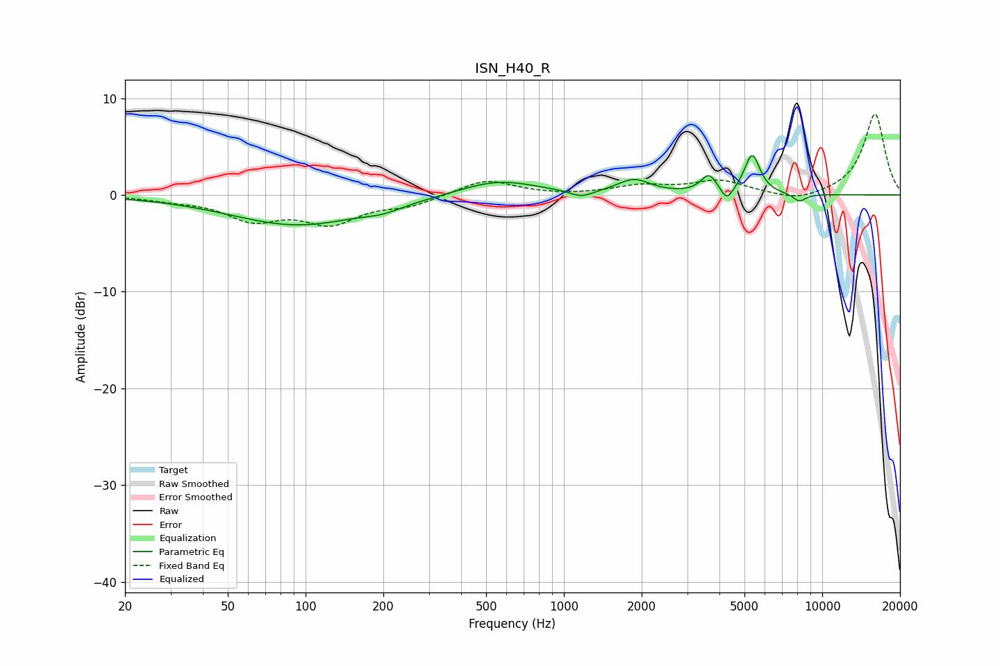

# ISN_H40_R
See [usage instructions](https://github.com/jaakkopasanen/AutoEq#usage) for more options and info.

### Parametric EQs
Apply preamp of -4.2 dB when using parametric equalizer.

|   # | Type    |   Fc (Hz) |    Q |   Gain (dB) |
|-----|---------|-----------|------|-------------|
|   1 | Peaking |        93 | 0.55 |        -3.1 |
|   2 | Peaking |       201 | 1.91 |        -0.6 |
|   3 | Peaking |       555 | 0.96 |         1.6 |
|   4 | Peaking |      1168 | 3.14 |        -0.7 |
|   5 | Peaking |      1867 | 2.22 |         1.5 |
|   6 | Peaking |      3639 | 4.74 |         1.4 |
|   7 | Peaking |      3675 | 3.96 |         0.4 |
|   8 | Peaking |      4274 | 6    |        -1.4 |
|   9 | Peaking |      5356 | 4.65 |         4.1 |
|  10 | Peaking |      8156 | 5.14 |        -0.8 |

### Fixed Band EQs
When using fixed band (also called graphic) equalizer, apply preamp of **-8.4 dB** (if available) and set gains manually with these parameters.

|   # | Type    |   Fc (Hz) |    Q |   Gain (dB) |
|-----|---------|-----------|------|-------------|
|   1 | Peaking |        31 | 1.41 |        -0.4 |
|   2 | Peaking |        62 | 1.41 |        -2.4 |
|   3 | Peaking |       125 | 1.41 |        -2.7 |
|   4 | Peaking |       250 | 1.41 |        -1   |
|   5 | Peaking |       500 | 1.41 |         1.6 |
|   6 | Peaking |      1000 | 1.41 |        -0.1 |
|   7 | Peaking |      2000 | 1.41 |         0.9 |
|   8 | Peaking |      4000 | 1.41 |         1.4 |
|   9 | Peaking |      8000 | 1.41 |        -0.8 |
|  10 | Peaking |     16000 | 1.41 |         8.4 |

### Graphs

