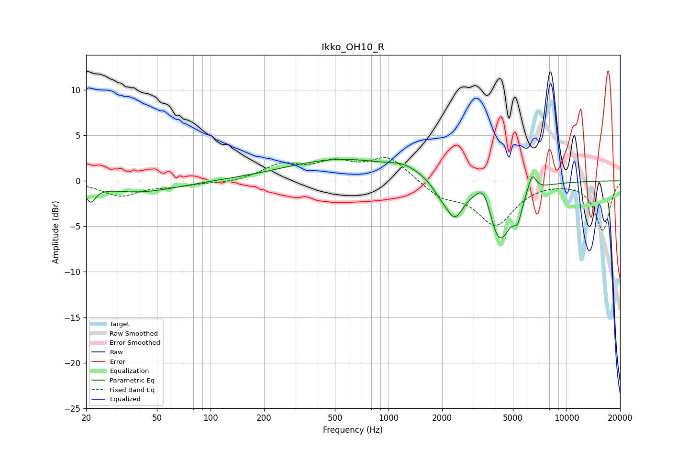

# Ikko_OH10_R
See [usage instructions](https://github.com/jaakkopasanen/AutoEq#usage) for more options and info.

### Parametric EQs
Apply preamp of -2.5 dB when using parametric equalizer.

|   # | Type    |   Fc (Hz) |    Q |   Gain (dB) |
|-----|---------|-----------|------|-------------|
|   1 | Peaking |        21 | 5.22 |        -1.7 |
|   2 | Peaking |        40 | 0.67 |        -1.2 |
|   3 | Peaking |       540 | 0.45 |         2.3 |
|   4 | Peaking |      1226 | 1.68 |         0.8 |
|   5 | Peaking |      1928 | 3.48 |        -0.8 |
|   6 | Peaking |      2344 | 2.79 |        -3.7 |
|   7 | Peaking |      3438 | 3.39 |         2.6 |
|   8 | Peaking |      4198 | 2.09 |        -6.9 |
|   9 | Peaking |      5319 | 6    |        -2   |
|  10 | Peaking |      6403 | 6    |         2   |

### Fixed Band EQs
When using fixed band (also called graphic) equalizer, apply preamp of **-2.6 dB** (if available) and set gains manually with these parameters.

|   # | Type    |   Fc (Hz) |    Q |   Gain (dB) |
|-----|---------|-----------|------|-------------|
|   1 | Peaking |        31 | 1.41 |        -1.6 |
|   2 | Peaking |        62 | 1.41 |        -0.5 |
|   3 | Peaking |       125 | 1.41 |        -0.3 |
|   4 | Peaking |       250 | 1.41 |         1.7 |
|   5 | Peaking |       500 | 1.41 |         1.7 |
|   6 | Peaking |      1000 | 1.41 |         2.6 |
|   7 | Peaking |      2000 | 1.41 |        -1.6 |
|   8 | Peaking |      4000 | 1.41 |        -4.7 |
|   9 | Peaking |      8000 | 1.41 |         0   |
|  10 | Peaking |     16000 | 1.41 |        -5.4 |

### Graphs

