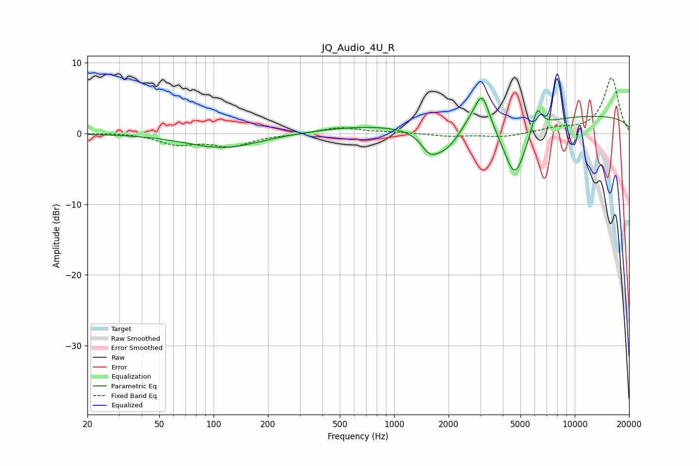

# JQ_Audio_4U_R
See [usage instructions](https://github.com/jaakkopasanen/AutoEq#usage) for more options and info.

### Parametric EQs
Apply preamp of -5.1 dB when using parametric equalizer.

|   # | Type    |   Fc (Hz) |    Q |   Gain (dB) |
|-----|---------|-----------|------|-------------|
|   1 | Peaking |       113 | 0.7  |        -2.1 |
|   2 | Peaking |       705 | 0.47 |         1   |
|   3 | Peaking |      1558 | 3.34 |        -1.1 |
|   4 | Peaking |      1589 | 2.68 |        -1.1 |
|   5 | Peaking |      1920 | 1.68 |        -3.3 |
|   6 | Peaking |      2621 | 2.53 |         1   |
|   7 | Peaking |      3071 | 3.41 |         5   |
|   8 | Peaking |      4655 | 2.19 |        -8.1 |
|   9 | Peaking |      6187 | 5.05 |         3.4 |
|  10 | Peaking |     10000 | 0.18 |         2.6 |

### Fixed Band EQs
When using fixed band (also called graphic) equalizer, apply preamp of **-8.0 dB** (if available) and set gains manually with these parameters.

|   # | Type    |   Fc (Hz) |    Q |   Gain (dB) |
|-----|---------|-----------|------|-------------|
|   1 | Peaking |        31 | 1.41 |         0.2 |
|   2 | Peaking |        62 | 1.41 |        -1.4 |
|   3 | Peaking |       125 | 1.41 |        -1.7 |
|   4 | Peaking |       250 | 1.41 |        -0.1 |
|   5 | Peaking |       500 | 1.41 |         0.9 |
|   6 | Peaking |      1000 | 1.41 |         0.2 |
|   7 | Peaking |      2000 | 1.41 |        -0.4 |
|   8 | Peaking |      4000 | 1.41 |        -0.5 |
|   9 | Peaking |      8000 | 1.41 |         0.7 |
|  10 | Peaking |     16000 | 1.41 |         7.9 |

### Graphs

