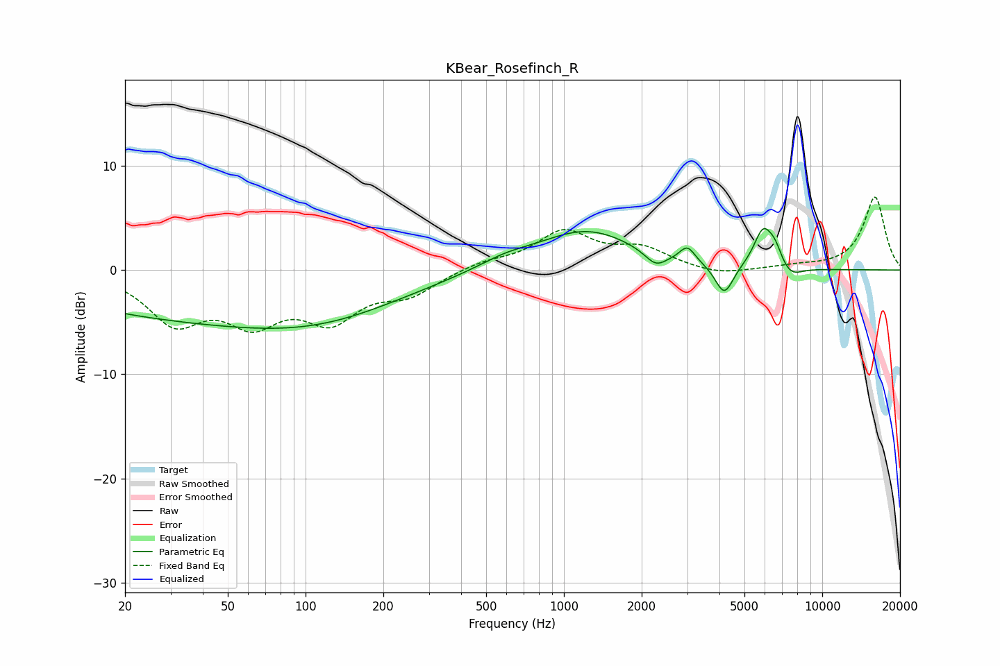

# KBear_Rosefinch_R
See [usage instructions](https://github.com/jaakkopasanen/AutoEq#usage) for more options and info.

### Parametric EQs
Apply preamp of -4.1 dB when using parametric equalizer.

|   # | Type    |   Fc (Hz) |    Q |   Gain (dB) |
|-----|---------|-----------|------|-------------|
|   1 | Peaking |        38 | 0.24 |        -4.4 |
|   2 | Peaking |       131 | 0.45 |        -2.2 |
|   3 | Peaking |       590 | 1.34 |         0.8 |
|   4 | Peaking |      1222 | 0.74 |         3.8 |
|   5 | Peaking |      2267 | 3.34 |        -1.3 |
|   6 | Peaking |      3006 | 4.68 |         1.5 |
|   7 | Peaking |      4178 | 3.99 |        -3   |
|   8 | Peaking |      5901 | 3.77 |         3.6 |
|   9 | Peaking |      6567 | 4.73 |         1.5 |
|  10 | Peaking |      7505 | 3.03 |        -1.2 |

### Fixed Band EQs
When using fixed band (also called graphic) equalizer, apply preamp of **-7.1 dB** (if available) and set gains manually with these parameters.

|   # | Type    |   Fc (Hz) |    Q |   Gain (dB) |
|-----|---------|-----------|------|-------------|
|   1 | Peaking |        31 | 1.41 |        -4.7 |
|   2 | Peaking |        62 | 1.41 |        -4.3 |
|   3 | Peaking |       125 | 1.41 |        -4.3 |
|   4 | Peaking |       250 | 1.41 |        -2.1 |
|   5 | Peaking |       500 | 1.41 |         0.7 |
|   6 | Peaking |      1000 | 1.41 |         3.5 |
|   7 | Peaking |      2000 | 1.41 |         1.9 |
|   8 | Peaking |      4000 | 1.41 |        -0.6 |
|   9 | Peaking |      8000 | 1.41 |         0.3 |
|  10 | Peaking |     16000 | 1.41 |         7   |

### Graphs

