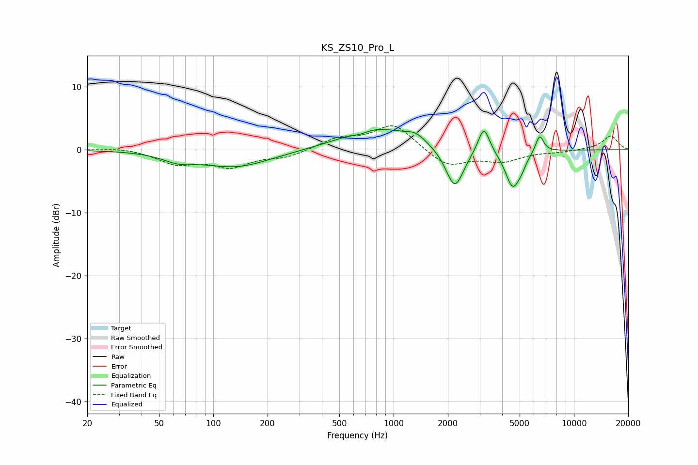

# KS_ZS10_Pro_L
See [usage instructions](https://github.com/jaakkopasanen/AutoEq#usage) for more options and info.

### Parametric EQs
Apply preamp of -3.3 dB when using parametric equalizer.

|   # | Type    |   Fc (Hz) |    Q |   Gain (dB) |
|-----|---------|-----------|------|-------------|
|   1 | Peaking |        64 | 1.62 |        -1.2 |
|   2 | Peaking |       134 | 0.74 |        -2.7 |
|   3 | Peaking |       654 | 3.11 |        -0.5 |
|   4 | Peaking |       791 | 0.77 |         3.5 |
|   5 | Peaking |      1327 | 2.4  |         1.3 |
|   6 | Peaking |      2183 | 2.81 |        -6.5 |
|   7 | Peaking |      3165 | 4.35 |         4.4 |
|   8 | Peaking |      4577 | 3.4  |        -5.9 |
|   9 | Peaking |      5124 | 5.73 |        -1   |
|  10 | Peaking |      6453 | 6    |         2.8 |

### Fixed Band EQs
When using fixed band (also called graphic) equalizer, apply preamp of **-3.9 dB** (if available) and set gains manually with these parameters.

|   # | Type    |   Fc (Hz) |    Q |   Gain (dB) |
|-----|---------|-----------|------|-------------|
|   1 | Peaking |        31 | 1.41 |         0.4 |
|   2 | Peaking |        62 | 1.41 |        -2.1 |
|   3 | Peaking |       125 | 1.41 |        -2.5 |
|   4 | Peaking |       250 | 1.41 |        -1.1 |
|   5 | Peaking |       500 | 1.41 |         1.7 |
|   6 | Peaking |      1000 | 1.41 |         4.1 |
|   7 | Peaking |      2000 | 1.41 |        -2.7 |
|   8 | Peaking |      4000 | 1.41 |        -1.7 |
|   9 | Peaking |      8000 | 1.41 |        -0.3 |
|  10 | Peaking |     16000 | 1.41 |         2.2 |

### Graphs

