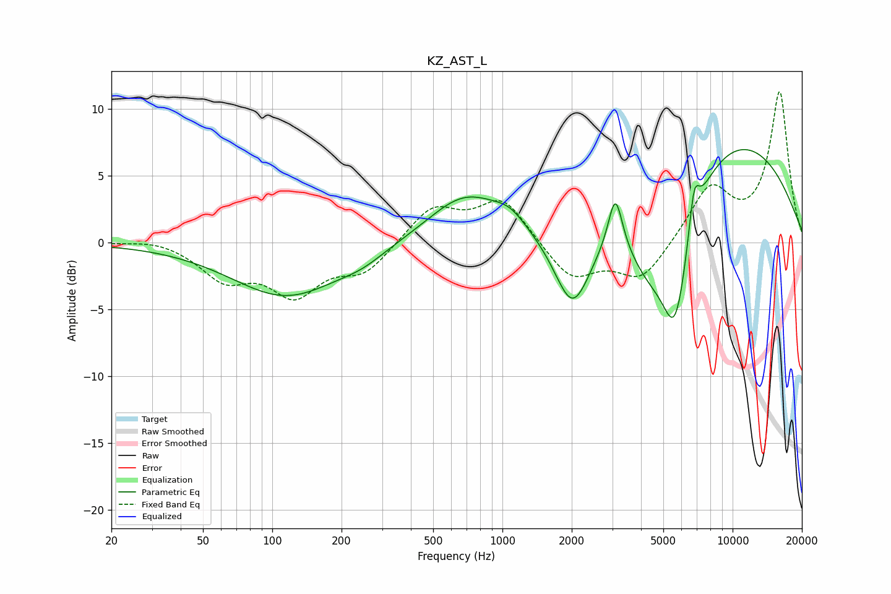

# KZ_AST_L
See [usage instructions](https://github.com/jaakkopasanen/AutoEq#usage) for more options and info.

### Parametric EQs
Apply preamp of -7.1 dB when using parametric equalizer.

|   # | Type    |   Fc (Hz) |    Q |   Gain (dB) |
|-----|---------|-----------|------|-------------|
|   1 | Peaking |       115 | 0.6  |        -4   |
|   2 | Peaking |       246 | 1.45 |        -0.6 |
|   3 | Peaking |       692 | 0.86 |         3.6 |
|   4 | Peaking |      1078 | 2.04 |         1   |
|   5 | Peaking |      2018 | 1.74 |        -6.1 |
|   6 | Peaking |      3095 | 4.59 |         4.2 |
|   7 | Peaking |      4306 | 1.33 |        -4.4 |
|   8 | Peaking |      5644 | 2.08 |        -9.6 |
|   9 | Peaking |      6801 | 5.96 |         3.2 |
|  10 | Peaking |      9371 | 0.33 |         8.1 |

### Fixed Band EQs
When using fixed band (also called graphic) equalizer, apply preamp of **-11.4 dB** (if available) and set gains manually with these parameters.

|   # | Type    |   Fc (Hz) |    Q |   Gain (dB) |
|-----|---------|-----------|------|-------------|
|   1 | Peaking |        31 | 1.41 |         0.4 |
|   2 | Peaking |        62 | 1.41 |        -2.5 |
|   3 | Peaking |       125 | 1.41 |        -3.6 |
|   4 | Peaking |       250 | 1.41 |        -2.1 |
|   5 | Peaking |       500 | 1.41 |         2.6 |
|   6 | Peaking |      1000 | 1.41 |         3.3 |
|   7 | Peaking |      2000 | 1.41 |        -2.8 |
|   8 | Peaking |      4000 | 1.41 |        -2.8 |
|   9 | Peaking |      8000 | 1.41 |         4.1 |
|  10 | Peaking |     16000 | 1.41 |        11.2 |

### Graphs

