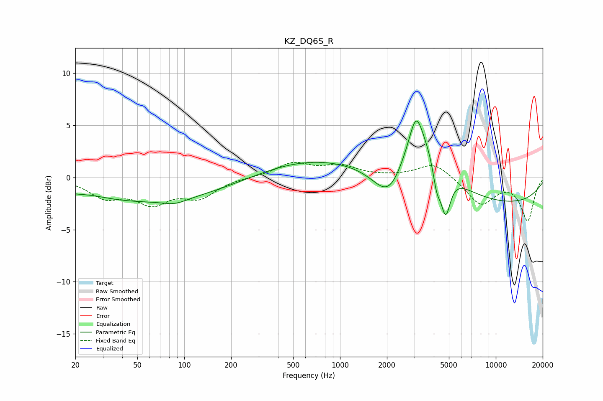

# KZ_DQ6S_R
See [usage instructions](https://github.com/jaakkopasanen/AutoEq#usage) for more options and info.

### Parametric EQs
Apply preamp of -5.5 dB when using parametric equalizer.

|   # | Type    |   Fc (Hz) |    Q |   Gain (dB) |
|-----|---------|-----------|------|-------------|
|   1 | Peaking |        25 | 1.13 |         0.4 |
|   2 | Peaking |        68 | 0.18 |        -2.5 |
|   3 | Peaking |        87 | 1.88 |        -0.5 |
|   4 | Peaking |       509 | 0.35 |         2.2 |
|   5 | Peaking |      2092 | 1.34 |        -4.4 |
|   6 | Peaking |      3074 | 3.48 |         3   |
|   7 | Peaking |      3182 | 0.86 |         6.1 |
|   8 | Peaking |      4170 | 5.67 |        -2.3 |
|   9 | Peaking |      4757 | 4.35 |        -4.4 |
|  10 | Peaking |      9300 | 0.24 |        -2.7 |

### Fixed Band EQs
When using fixed band (also called graphic) equalizer, apply preamp of **-1.6 dB** (if available) and set gains manually with these parameters.

|   # | Type    |   Fc (Hz) |    Q |   Gain (dB) |
|-----|---------|-----------|------|-------------|
|   1 | Peaking |        31 | 1.41 |        -1.7 |
|   2 | Peaking |        62 | 1.41 |        -2.2 |
|   3 | Peaking |       125 | 1.41 |        -1.8 |
|   4 | Peaking |       250 | 1.41 |         0   |
|   5 | Peaking |       500 | 1.41 |         1.3 |
|   6 | Peaking |      1000 | 1.41 |         1   |
|   7 | Peaking |      2000 | 1.41 |         0   |
|   8 | Peaking |      4000 | 1.41 |         1.5 |
|   9 | Peaking |      8000 | 1.41 |        -2.6 |
|  10 | Peaking |     16000 | 1.41 |        -4.1 |

### Graphs

