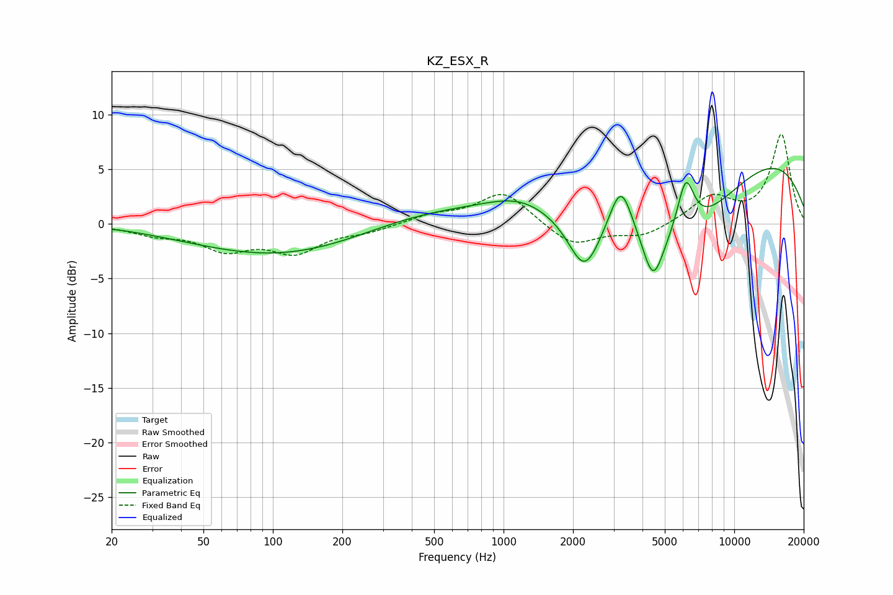

# KZ_ESX_R
See [usage instructions](https://github.com/jaakkopasanen/AutoEq#usage) for more options and info.

### Parametric EQs
Apply preamp of -5.2 dB when using parametric equalizer.

|   # | Type    |   Fc (Hz) |    Q |   Gain (dB) |
|-----|---------|-----------|------|-------------|
|   1 | Peaking |        21 | 1.36 |         0.1 |
|   2 | Peaking |       110 | 0.37 |        -3   |
|   3 | Peaking |       456 | 0.48 |         1.4 |
|   4 | Peaking |      1186 | 0.9  |         1.9 |
|   5 | Peaking |      2241 | 2.08 |        -4.9 |
|   6 | Peaking |      3225 | 2.8  |         4.9 |
|   7 | Peaking |      4449 | 3.11 |        -4.6 |
|   8 | Peaking |      5978 | 0.5  |        -8   |
|   9 | Peaking |      6161 | 3.69 |         5   |
|  10 | Peaking |     10000 | 0.26 |         8.3 |

### Fixed Band EQs
When using fixed band (also called graphic) equalizer, apply preamp of **-8.3 dB** (if available) and set gains manually with these parameters.

|   # | Type    |   Fc (Hz) |    Q |   Gain (dB) |
|-----|---------|-----------|------|-------------|
|   1 | Peaking |        31 | 1.41 |        -0.8 |
|   2 | Peaking |        62 | 1.41 |        -2.1 |
|   3 | Peaking |       125 | 1.41 |        -2.4 |
|   4 | Peaking |       250 | 1.41 |        -0.6 |
|   5 | Peaking |       500 | 1.41 |         0.8 |
|   6 | Peaking |      1000 | 1.41 |         3   |
|   7 | Peaking |      2000 | 1.41 |        -2.1 |
|   8 | Peaking |      4000 | 1.41 |        -1.2 |
|   9 | Peaking |      8000 | 1.41 |         2.4 |
|  10 | Peaking |     16000 | 1.41 |         8.1 |

### Graphs

