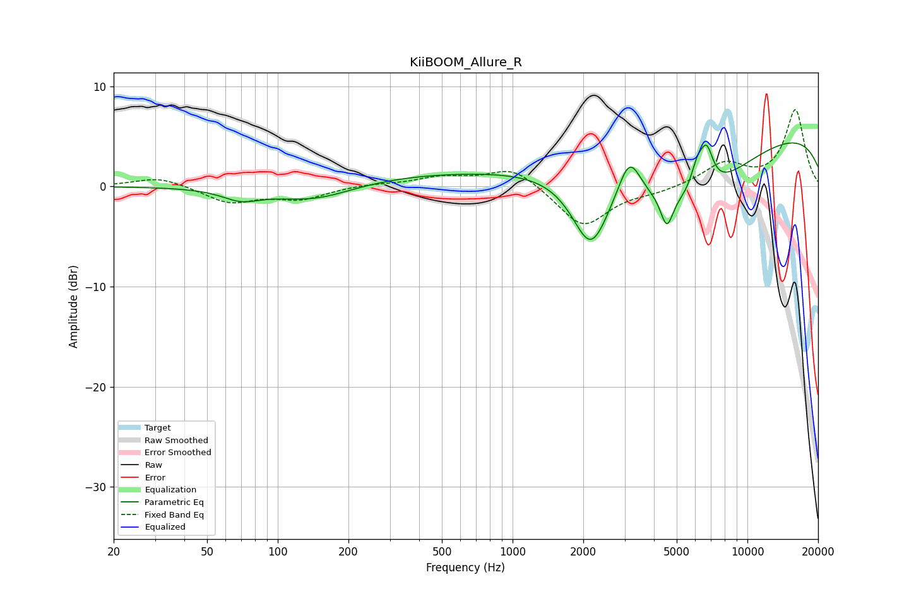

# KiiBOOM_Allure_R
See [usage instructions](https://github.com/jaakkopasanen/AutoEq#usage) for more options and info.

### Parametric EQs
Apply preamp of -4.4 dB when using parametric equalizer.

|   # | Type    |   Fc (Hz) |    Q |   Gain (dB) |
|-----|---------|-----------|------|-------------|
|   1 | Peaking |        70 | 1.78 |        -1.1 |
|   2 | Peaking |       142 | 0.79 |        -1.9 |
|   3 | Peaking |       678 | 0.19 |         1.4 |
|   4 | Peaking |      2153 | 1.76 |        -7.4 |
|   5 | Peaking |      3145 | 2.95 |         4.1 |
|   6 | Peaking |      4538 | 5.44 |        -3.1 |
|   7 | Peaking |      5510 | 0.56 |        -6.9 |
|   8 | Peaking |      6106 | 5.12 |         2.3 |
|   9 | Peaking |      6701 | 4.71 |         3.8 |
|  10 | Peaking |     10000 | 0.18 |         5.9 |

### Fixed Band EQs
When using fixed band (also called graphic) equalizer, apply preamp of **-7.8 dB** (if available) and set gains manually with these parameters.

|   # | Type    |   Fc (Hz) |    Q |   Gain (dB) |
|-----|---------|-----------|------|-------------|
|   1 | Peaking |        31 | 1.41 |         1   |
|   2 | Peaking |        62 | 1.41 |        -1.6 |
|   3 | Peaking |       125 | 1.41 |        -1.2 |
|   4 | Peaking |       250 | 1.41 |         0.2 |
|   5 | Peaking |       500 | 1.41 |         0.9 |
|   6 | Peaking |      1000 | 1.41 |         2   |
|   7 | Peaking |      2000 | 1.41 |        -4.1 |
|   8 | Peaking |      4000 | 1.41 |        -0.5 |
|   9 | Peaking |      8000 | 1.41 |         2.2 |
|  10 | Peaking |     16000 | 1.41 |         7.6 |

### Graphs

