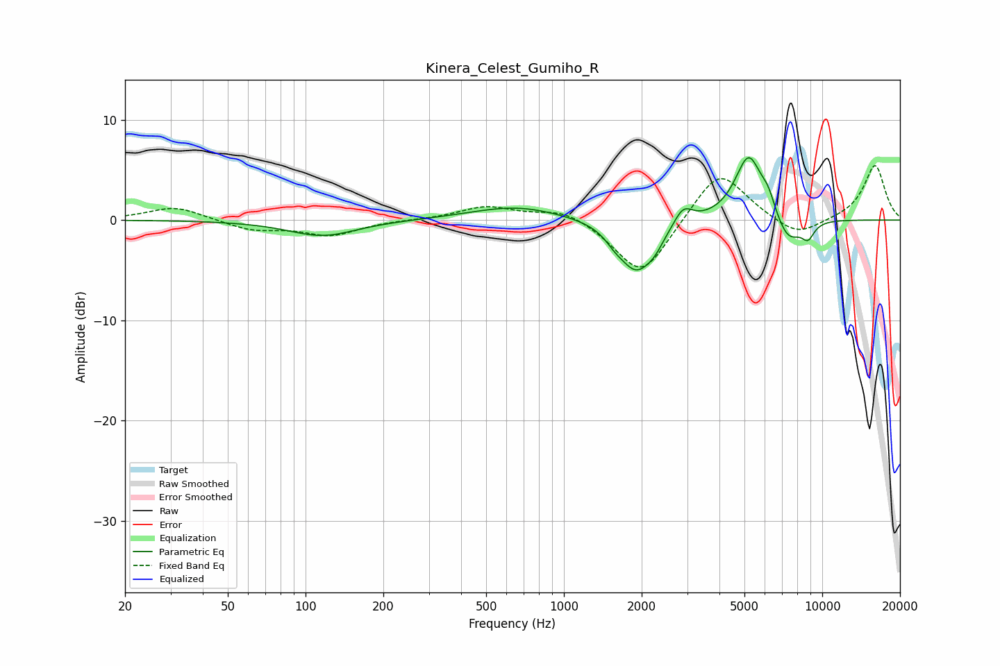

# Kinera_Celest_Gumiho_R
See [usage instructions](https://github.com/jaakkopasanen/AutoEq#usage) for more options and info.

### Parametric EQs
Apply preamp of -6.3 dB when using parametric equalizer.

|   # | Type    |   Fc (Hz) |    Q |   Gain (dB) |
|-----|---------|-----------|------|-------------|
|   1 | Peaking |       116 | 1.07 |        -1.6 |
|   2 | Peaking |       654 | 0.8  |         1.4 |
|   3 | Peaking |      1573 | 4.01 |        -0.7 |
|   4 | Peaking |      1903 | 2.12 |        -4.9 |
|   5 | Peaking |      2248 | 3.81 |        -1.1 |
|   6 | Peaking |      2897 | 3.93 |         1.8 |
|   7 | Peaking |      5192 | 2.6  |         6.5 |
|   8 | Peaking |      6177 | 5.12 |         1.5 |
|   9 | Peaking |      7372 | 2.66 |        -2.6 |
|  10 | Peaking |      8810 | 5.19 |        -1.5 |

### Fixed Band EQs
When using fixed band (also called graphic) equalizer, apply preamp of **-5.5 dB** (if available) and set gains manually with these parameters.

|   # | Type    |   Fc (Hz) |    Q |   Gain (dB) |
|-----|---------|-----------|------|-------------|
|   1 | Peaking |        31 | 1.41 |         1.4 |
|   2 | Peaking |        62 | 1.41 |        -1   |
|   3 | Peaking |       125 | 1.41 |        -1.5 |
|   4 | Peaking |       250 | 1.41 |         0   |
|   5 | Peaking |       500 | 1.41 |         1.3 |
|   6 | Peaking |      1000 | 1.41 |         1.2 |
|   7 | Peaking |      2000 | 1.41 |        -5.8 |
|   8 | Peaking |      4000 | 1.41 |         5.3 |
|   9 | Peaking |      8000 | 1.41 |        -1.8 |
|  10 | Peaking |     16000 | 1.41 |         5.5 |

### Graphs

